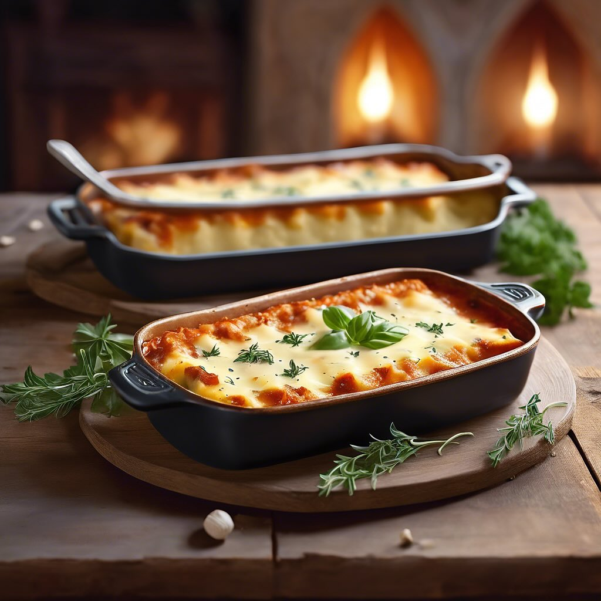

# ### Ingredienti: #### Per la pasta: - 250 g di farina di ceci - 1 cucchiaio d’ol

### Ingredienti: #### Per la pasta: - 250 g di farina di ceci - 1 cucchiaio d’olio extravergine d’oliva - Acqua q.b. - Sale q.b. #### Per il ripieno: - 200 g di gorgonzola - 150 g di cavolo nero - 50 g di parmigiano grattugiato - 1 spicchio d’aglio - Olio extravergine d’oliva - Sale e pepe q.b. #### Per la salsa: - 200 ml di panna da cucina (puoi usare panna vegetale se preferisci) - 50 g di parmigiano grattugiato - Noce moscata q.b. ### Procedimento: 1. **Preparare la pasta**: In una ciotola, mescola la farina di ceci con un pizzico di sale. Aggiungi l’olio e l’acqua poco alla volta, impastando fino a ottenere un impasto liscio e omogeneo. Lascia riposare per circa 30 minuti. 2. **Preparare il ripieno**: In una padella, scalda un filo d’olio d’oliva e aggiungi l’aglio tritato. Quando è dorato, aggiungi il cavolo nero lavato e tagliato a strisce. Cuoci fino a quando il cavolo è tenero. Togli dal fuoco e lascia raffreddare. In una ciotola, unisci il cavolo cotto, il gorgonzola a pezzetti e il parmigiano. Mescola bene fino a ottenere una crema omogenea. Aggiusta di sale e pepe. 3. **Stendere la pasta**: Stendi l’impasto di farina di ceci su un piano di lavoro infarinato, formando delle sfoglie sottili. Taglia le sfoglie in rettangoli di circa 10x15 cm. 4. **Farciare i cannelloni**: Posiziona un cucchiaio di ripieno su un lato del rettangolo di pasta e arrotola per formare il cannellone. Ripeti l’operazione fino a esaurire gli ingredienti. 5. **Preparare la salsa**: In un pentolino, scalda la panna con il parmigiano grattugiato e una grattugiata di noce moscata. Mescola fino a ottenere una salsa cremosa. 6. **Cuocere i cannelloni**: Disponi i cannelloni in una teglia leggermente unta. Versa la salsa sopra i cannelloni e spolverizza con ulteriore parmigiano. Cuoci in forno preriscaldato a 180°C per circa 25-30 minuti, fino a quando sono dorati e la salsa bolle. 7. **Servire**: Sforna i cannelloni e lasciali riposare per qualche minuto. Servi caldi, magari con una spolverata di pepe nero e un filo d’olio d’oliva.

---

*Ricetta da @leguminando*
