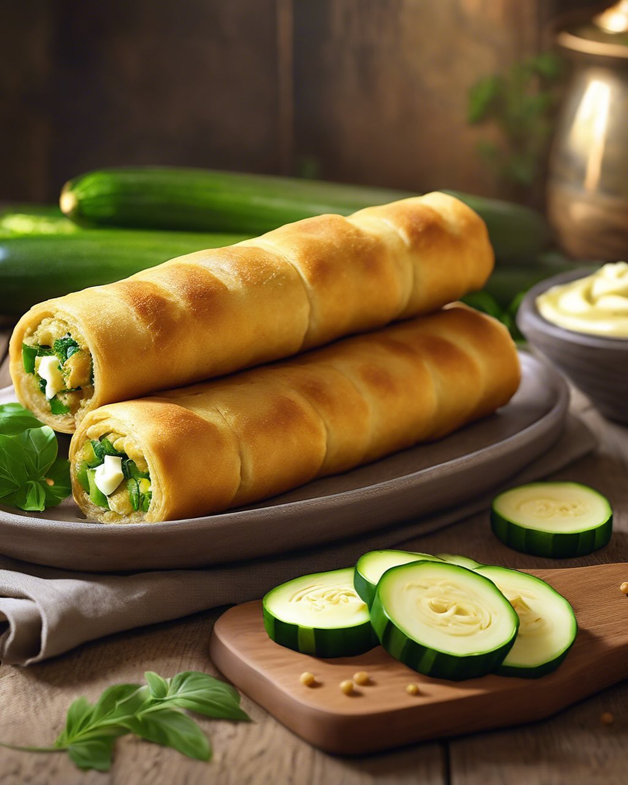

# ### Ingredienti #### Per la torta: - 150 g di farina di carrube - 50 g di cacao 

### Ingredienti #### Per la torta: - 150 g di farina di carrube - 50 g di cacao in polvere - 200 g di zucchero - 3 uova - 100 ml di olio di semi - 200 ml di latte - 1 bustina di lievito per dolci - Un pizzico di sale #### Per la crema di cachi: - 2 cachi maturi - 100 g di zucchero - 200 ml di panna fresca #### Per la decorazione: - Chicchi di melograno ### Procedimento 1. **Preparare la torta**: - In una ciotola, sbatti le uova con lo zucchero fino a ottenere un composto chiaro e spumoso. - Aggiungi l’olio e il latte, mescolando bene. - In un’altra ciotola, setaccia la farina di carrube, il cacao, il lievito e il sale. Unisci gli ingredienti secchi a quelli umidi, mescolando fino a ottenere un impasto omogeneo. - Versa l’impasto in una teglia imburrata e infarinata e cuoci in forno preriscaldato a 180°C per circa 30-35 minuti. Fai la prova dello stecchino per verificare la cottura. 2. **Preparare la crema di cachi**: - Sbuccia i cachi e frullali fino a ottenere una purea liscia. - Monta la panna e incorporala delicatamente alla purea di cachi. Aggiungi lo zucchero se desideri un sapore più dolce. 3. **Assemblare la torta**: - Una volta che la torta è fredda, tagliala a metà e farciscila con la crema di cachi. Aggiungi i chicchi di melograno all’interno. - Copri con l’altra metà della torta e decora la superficie con altra crema di cachi e chicchi di melograno. 4. **Servire**: - Lascia riposare in frigorifero per un’ora prima di servire per far amalgamare i sapori.

---

*Ricetta da @leguminando*
