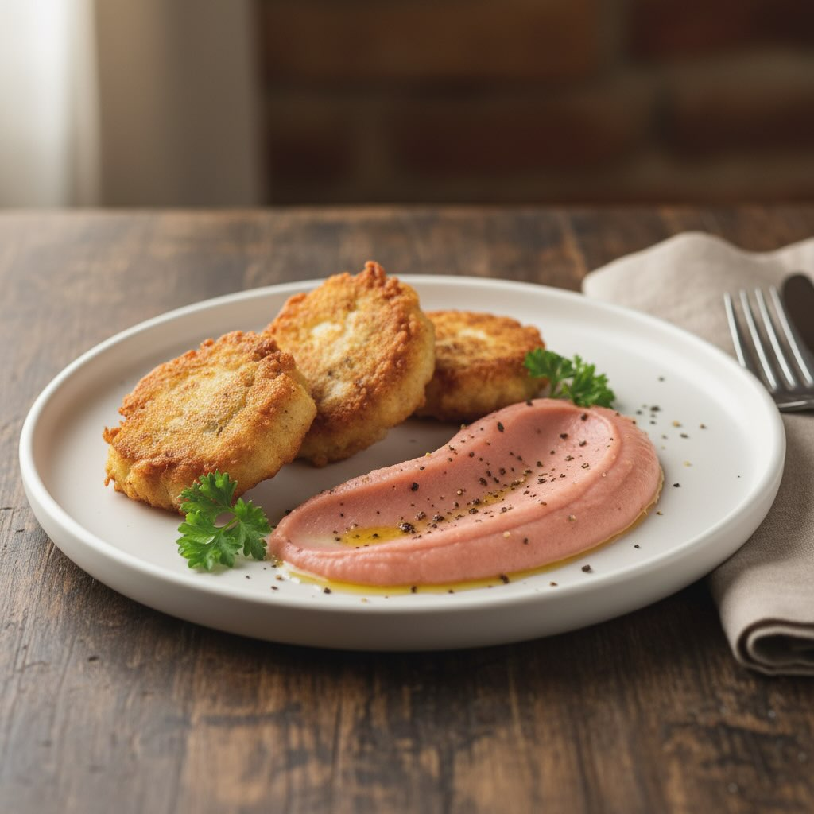

# ### Ingredienti ## Per le Polpette - 300 g di baccalà dissalato - 200 g di cicer

### Ingredienti ## Per le Polpette - 300 g di baccalà dissalato - 200 g di cicerchie cotte - 2 spicchi d&#039;a’lio tritati - 1 uovo - 50 g di pangrattato - Prezzemolo fresco tritato - Sale e pepe q.b. - Olio d&#039;o’iva per friggere Per la Purea di Patate Rosse - 500 g di patate rosse - 100 ml di latte - 50 g di burro - Sale q.b. - Pepe nero macinato fresco Preparazione Polpette di Baccalà e Cicerchie 1. **Preparazione del Baccalà**: Se necessario, dissalare il baccalà lasciandolo in ammollo in acqua per 24-48 ore, cambiando l&#039;acqua ogni 8’ore. Una volta dissalato, sminuzzarlo. 2. **Mescolare gli Ingredienti**: In una ciotola grande, unire il baccalà sminuzzato, le cicerchie cotte, l&#039;aglio, l&#039;uov’, il pan’rattato, e il prezzemolo. Mescolare bene fino a ottenere un composto omogeneo. Aggiustare di sale e pepe. 3. **Formare le Polpette**: Con le mani umide, formare delle polpette della dimensione desiderata. 4. **Friggere**: Scaldare l’olio in una padella e friggere le polpette fino a quando saranno dorate e croccanti. Scolare su carta assorbente. Purea di Patate Rosse 1. **Cuocere le Patate**: Pelare e tagliare le patate a pezzi. Cuocerle in acqua bollente salata fino a quando sono tenere. 2. **Preparare la Purea**: Scolare le patate e schiacciarle in una ciotola. Aggiungere il burro, il latte, sale e pepe. Mescolare fino a ottenere una consistenza cremosa.

---

*Ricetta da @leguminando*
