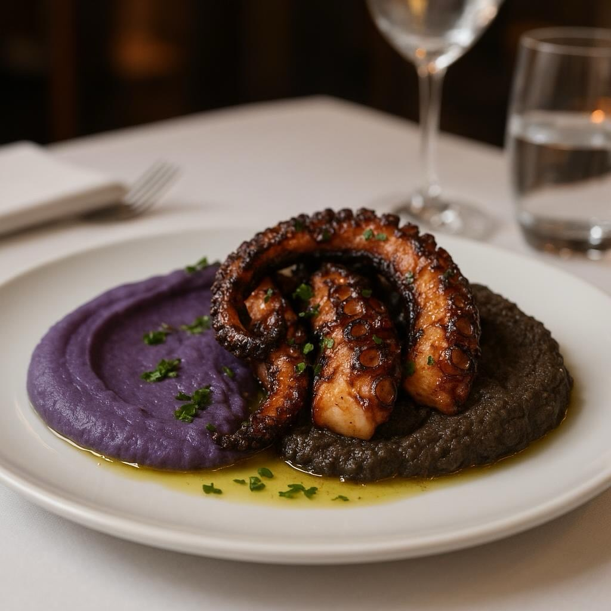

# ### Ingredienti ## Purea di Patate Viola - 500 g di patate viola - 50 g di burro

### Ingredienti ## Purea di Patate Viola - 500 g di patate viola - 50 g di burro - 100 ml di latte - Sale e pepe q.b. - Noce moscata (opzionale) Hummus di Ceci Neri - 200 g di ceci neri cotti - 2 cucchiai di tahina - Succo di 1 limone - 1 spicchio d&#039;aglio’- 2 cucchiai di olio d&#039;oliva’- Sale q.b. - Paprika affumicata (opzionale) Polpo alla Griglia - 1 polpo (circa 1 kg) - 2 foglie di alloro - 1 limone - Olio d&#039;oliva q.b’ - Prezzemolo tritato per guarnire - Sale e pepe q.b. Preparazione Purea di Patate Viola 1. **Cuocere le Patate**: Pelare e tagliare le patate viola a pezzi. Cuocere in acqua bollente salata fino a quando sono tenere. 2. **Schiacciare e Mescolare**: Scolare e schiacciare le patate. Aggiungere burro e latte, mescolando fino ad ottenere una consistenza cremosa. Condire con sale, pepe e noce moscata. Hummus di Ceci Neri 1. **Frullare gli Ingredienti**: In un frullatore, unire ceci neri, tahina, succo di limone, aglio e olio d&#039;oliva. Frullare fino’ad ottenere una consistenza liscia. 2. **Condire**: Aggiustare di sale e aggiungere paprika se desiderato. Polpo alla Griglia 1. **Preparare il Polpo**: Pulire il polpo e cuocerlo in acqua bollente con foglie di alloro fino a quando è tenero (circa 40-45 minuti). 2. **Grigliare**: Tagliare i tentacoli e grigliarli con un filo d’olio fino a quando sono leggermente croccanti. 3. **Condire**: Spruzzare con succo di limone e condire con sale e pepe.

---

*Ricetta da @leguminando*
