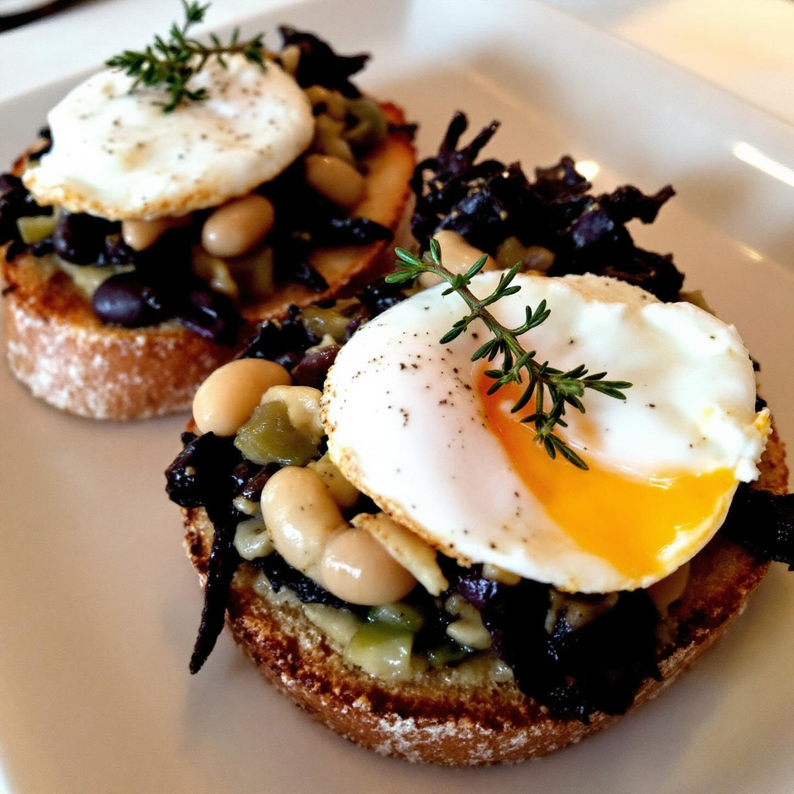

# Ingredienti (per 4 persone) - 100 g di fagioli borlotti lessati - 100 g di fagio

Ingredienti (per 4 persone) - 100 g di fagioli borlotti lessati - 100 g di fagioli neri lessati - 100 g di fagioli dall’occhio lessati - 1 mazzo di cavolo nero (circa 200 g) - 1 porro piccolo - 2 uova di quaglia (o 1 uovo piccolo) - 4–6 fette di pane casereccio - Olio extravergine di oliva, sale, pepe, un pizzico di peperoncino - Qualche fogliolina di timo o rosmarino fresco Preparazione 1. Sbollenta velocemente le foglie di cavolo nero, scolale e raffreddale in acqua ghiacciata. Strizzale e tritale finemente il più possibile. 2. In un filo d’olio, rosola il porro affettato sottile finché non diventa trasparente; aggiungi il cavolo nero tritato, sala, pepa e cuoci 5 minuti. 3. Frulla insieme i tre tipi di fagioli con un goccio d’olio, sale e peperoncino fino a ottenere una crema liscia. 4. Cuoci le uova di quaglia in camicia (o l’uovo piccolo) per 2–3 minuti. 5. Tosta le fette di pane in forno a 200 °C per 5 minuti o finché sono ben croccanti. 6. Spalma un velo di crema di fagioli sui crostini, adagia sopra un poco di cavolo nero al porro e completa con l’uovo in camicia. Decora con un rametto di timo o rosmarino.

---

*Ricetta da @leguminando*
