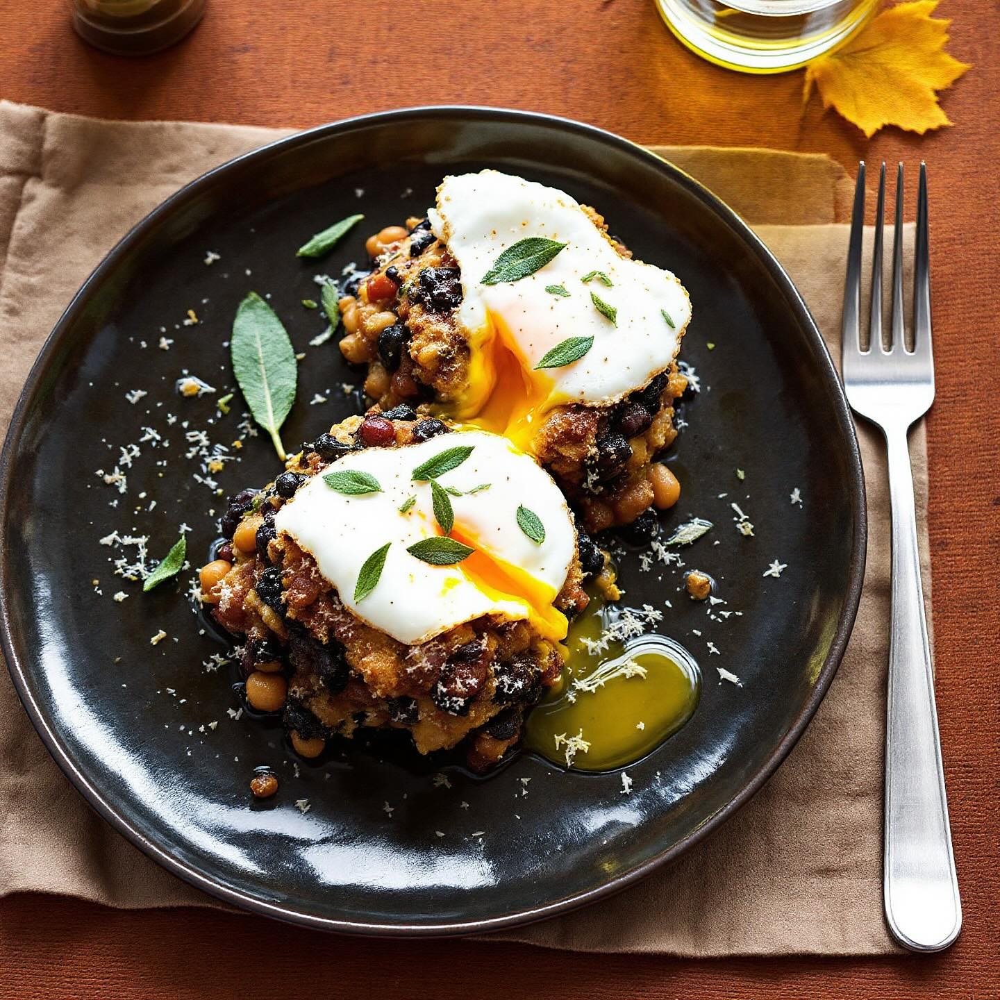

# Ingredienti (per 4 persone) - 120 g di fagioli borlotti lessati - 120 g di fagio

Ingredienti (per 4 persone) - 120 g di fagioli borlotti lessati - 120 g di fagioli neri lessati - 120 g di fagioli dall’occhio lessati - 1 porro - 150 g di cavolo nero - 4 uova - 50 g di formaggio grattugiato (pecorino o parmigiano) - Erbe aromatiche (salvia, alloro) - Olio, sale, pepe Preparazione 1. Affetta il porro e falla stufare in padella con un filo d’olio e qualche foglia di alloro. 2. Aggiungi i fagioli scolati e sciacquati, profuma con salvia tritata, sala e pepa; fai insaporire per 5 minuti. 3. Sbollenta il cavolo nero, scolalo, tritalo grossolanamente e incorporalo ai fagioli. 4. Versa il composto in quattro piccole pirofile monoporzione, spolvera con il formaggio e cuoci in forno a 180 °C per 15–20 minuti, finché si forma una leggera crosticina dorata. 5. Poco prima di servire, scalda un filo d’olio in padella e cuoci le uova al tegamino, regolandone la cottura a piacere. 6. Sforma gli sformati direttamente sui piatti e adagia l’uovo su ciascuno.

---

*Ricetta da @leguminando*
