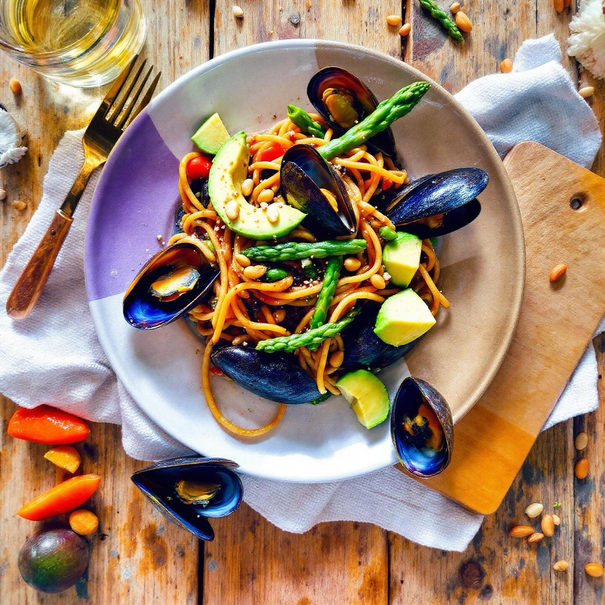

# #### Ingredienti per la Pasta: - 200 g di farina di lenticchie - 1 uovo (facolta

#### Ingredienti per la Pasta: - 200 g di farina di lenticchie - 1 uovo (facoltativo, per una consistenza più ricca) - Acqua q.b. - Sale q.b. #### Ingredienti per il Condimento: - 100 g di cozze - 1 avocado maturo - 50 g di pistacchi sgusciati - 50 g di pinoli - 200 g di asparagi - Succo di 1 lime - Olio extravergine d’oliva q.b. - Sale e pepe q.b. ### Preparazione della Pasta 1. **Preparare l’Impasto**: In una ciotola, setaccia la farina di lenticchie e unisci un pizzico di sale. Se desideri una pasta più ricca, puoi incorporare un uovo. Mescola il tutto con una forchetta. 2. **Aggiungere l’Acqua**: Versa gradualmente acqua fino a ottenere un composto omogeneo e lavorabile. Assicurati che l’impasto non sia appiccicoso, quindi aggiungi l’acqua poco a poco. 3. **Riposo dell’Impasto**: Forma una palla con l’impasto, avvolgila in pellicola trasparente e mettila in frigorifero per almeno 30 minuti. 4. **Stendere la Pasta**: Trascorso il tempo di riposo, stendi l’impasto su una superficie infarinata fino a raggiungere uno spessore di circa 2 mm. 5. **Tagliare la Pasta**: Ritaglia la pasta nella forma che preferisci (fettuccine, tagliatelle, ecc.) e lasciala asciugare per qualche minuto. ### Preparazione del Condimento 1. **Cottura delle Cozze**: In una pentola, porta a ebollizione dell’acqua e aggiungi le cozze. Cuocile finché non si aprono, quindi scolale e mettile da parte. 2. **Preparazione degli Asparagi**: Pulisci gli asparagi e lessali in acqua salata per 3-4 minuti fino a renderli teneri ma croccanti. Scolali e raffreddali in acqua e ghiaccio per mantenere il colore. 3. **Preparazione dell’Avocado**: Taglia l’avocado a metà, rimuovi il nocciolo e preleva la polpa. Schiacciala in una ciotola e aggiungi il succo di lime, un filo d’olio, sale e pepe. 4. **Tostare i Pistacchi e i Pinoli**: In una padella antiaderente, tosta i pistacchi e i pinoli a fuoco medio finché non diventano dorati e fragranti. 5. **Assemblaggio del Piatto**: Cuoci la pasta in acqua salata per 2-3 minuti, scolala e lasciala raffreddare. In una grande ciotola, unisci la pasta, le cozze, l’avocado, gli asparagi, i pistacchi e i pinoli. Condisci con un filo d’olio e regola di sale e pepe.

---

*Ricetta da @leguminando*
