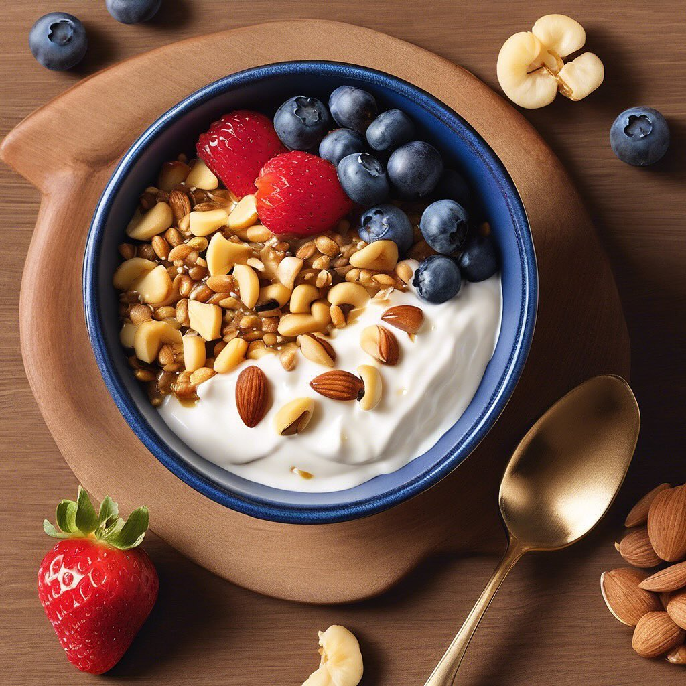

# La farinata di lenticchie è un piatto gustoso e ricco di proteine, perfetto per 

La farinata di lenticchie è un piatto gustoso e ricco di proteine, perfetto per chi cerca un’alternativa alle classiche preparazioni a base di farina di ceci. Ecco una ricetta semplice per prepararla con parmigiano e gorgonzola. ### Ingredienti: - 200 g di lenticchie secche (preferibilmente rosse o verdi) - 100 g di farina di ceci &#064;alcenerobiologico - 50 g di parmigiano grattugiato - 100 g di gorgonzola - 1 cipolla piccola, tritata - 2-3 cucchiai di olio d’oliva - Sale e pepe q.b. - Acqua q.b. - Rosmarino o altre erbe aromatiche (facoltativo) ### Procedimento: 1. **Preparazione delle lenticchie**: Sciacqua le lenticchie e mettile in ammollo per almeno un’ora. Dopo l’ammollo, scolale e cuocile in acqua salata fino a quando sono tenere (circa 20-30 minuti). Scolale nuovamente e frullale fino a ottenere una purea. 2. **Preparazione dell’impasto**: In una ciotola, mescola la purea di lenticchie con la farina di ceci, il parmigiano grattugiato, la cipolla tritata e un pizzico di sale e pepe. Aggiungi acqua fino a ottenere un composto fluido ma non troppo liquido. 3. **Cottura**: Preriscalda il forno a 200°C. Ungi una teglia con l’olio d’oliva e versa il composto. Distribuisci il gorgonzola a pezzetti sopra l’impasto. Puoi aggiungere anche rosmarino o altre erbe aromatiche a piacere. 4. **Cuocere**: Inforna per circa 30-35 minuti, o fino a quando la superficie è dorata e croccante. 5. **Servire**: Lascia raffreddare leggermente prima di tagliare a fette. La farinata di lenticchie si può servire calda o a temperatura ambiente.

---

*Ricetta da @leguminando*
