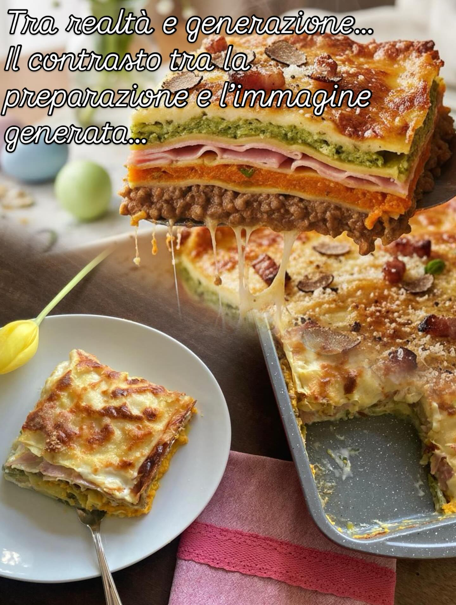

# La prima collaborazione

La prima collaborazione.. “dall’idea alla tavola” Questo post così diverso da solito è stato fatto in collaborazione con &#064;mariarosachioetto è la nostra prima collaborazione e ne andiamo fieri… Tutto inizia con la necessità di fare una lasagna diversa dal solito, ci mettiamo all’opera ed assieme a &#064;mariarosachioetto studiamo alcune ricette, ne selezioniamo tre, ed infine optiamo per la ricetta della lasagna arcobaleno 🌈. Utilizzando la nostra AI, LegumAI, verifichiamo e bilanciamo la ricetta, generiamo alcune immagini del risultato finale… ci piace e decidiamo di procedere… Il post riporta gli scatti della preparazione della lasagna arcobaleno da parte di &#064;mariarosachioetto a cui va il nostro grazie!!! … mentre l’immagine finale è un parallelismo tra quanto generato da LegumAI e la splendida lasagna prodotta da &#064;mariarosachioetto È stata una splendida collaborazione che ci ha permesso di utilizzare LegumAI come strumento preventivo per la pianificazione di un piatto oltre che come strumento di supporto durante la preparazione… Ma non sarebbe stato possibile senza l’aiuto di &#064;mariarosachioetto a cui va il nostro GRAZIE per aver creduto in noi ed aver realizzato questa splendida lasagna arcobaleno 🌈

---

*Ricetta da @leguminando*
