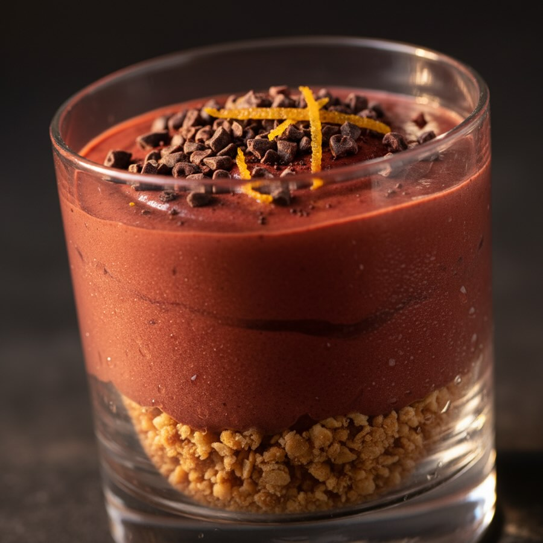

# Mousse Rubino della Terra #leguminando Ingredienti ## Per la mousse - 150 ml di 

Mousse Rubino della Terra #leguminando Ingredienti ## Per la mousse - 150 ml di latte di avena (o panna di cocco) - 80 g di farina di carrube - 100 g di barbabietola cotta (pelata) - 100 g di cioccolato fondente al 70% - 30 g di zucchero di canna integrale - Scorza grattugiata fine di 1 arancia bio Per la base croccante - 60 g di fiocchi d&#039;avena integrali - 20 g di burro (o olio di cocco) - 10 g di zucchero di canna - 30 g di cacao in chicchi (tostati e spezzettati) Decorazione - Cacao in chicchi interi tostati - Scorza d’arancia candita a julienne - Sale Maldon in scaglie **Descrizione:** Mousse rubino: carruba incontra barbabietola. Terra dolce in un boccone. 🫘 **Hashtag:** #moussecarruba #dolcivegan

---

*Ricetta da @leguminando*
