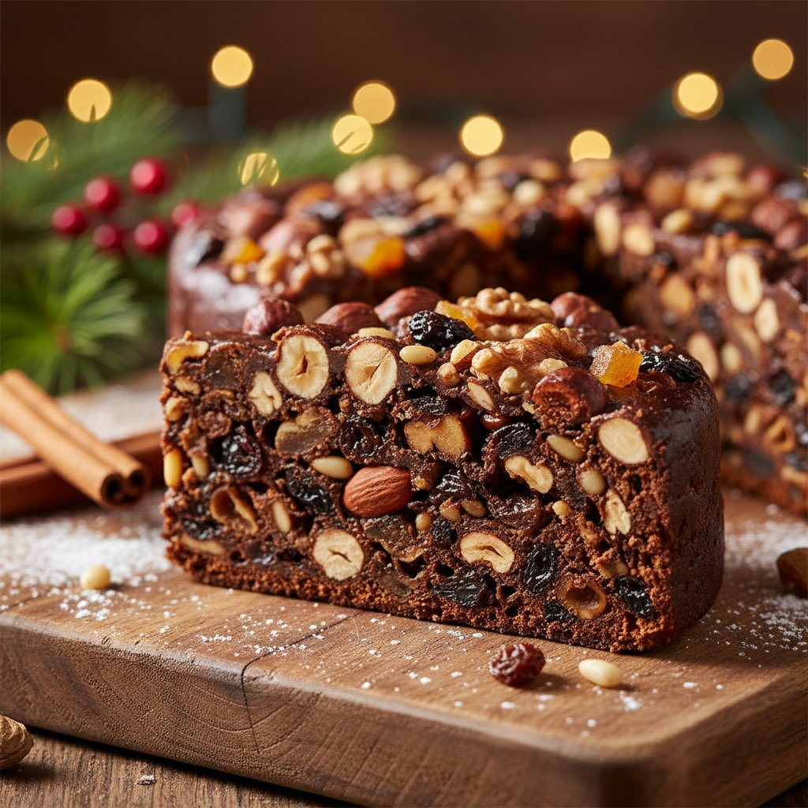

# Panpepato #### Ingredienti - 160 g di nocciole - 160 g di mandorle pelate - 160 

Panpepato #### Ingredienti - 160 g di nocciole - 160 g di mandorle pelate - 160 g di noci - 100 g di uvetta - 100 g di arancia candita - 160 g di fichi secchi - 65 g di farina di carrube (o farina di lenticchie come alternativa) - 60 g di cacao amaro - 30 g di lenticchie cotte e frullate - 160 g di miele - 20 ml di caffè - 6 ml di rum - 40 g di pinoli # Procedimento 1. **Preparazione della Frutta Secca:** - Tritate grossolanamente le nocciole, le mandorle, le noci, e i pinoli. - Tagliate a pezzetti i fichi secchi e l&#039;ar’ncia candita. 2. **Ammollare l&#039;Uv’tta:** - Mettete l&#039;uv’tta in ammollo in acqua tiepida per circa 10 minuti, poi scolatela e asciugatela. 3. **Mescolare gli Ingredienti:** - In una ciotola capiente, unite la frutta secca tritata, l&#039;uv’tta, l&#039;ar’ncia candita, e i fichi secchi. - Aggiungete la farina di carrube (o di lenticchie), il cacao amaro, e le lenticchie frullate. - Mescolate bene gli ingredienti secchi. 4. **Preparare il Miele e il Caffè:** - In un pentolino, scaldate il miele con il caffè fino a quando il miele si scioglie completamente. - Aggiungete il rum e mescolate. 5. **Combinare e Impastare:** - Versate il composto di miele sopra gli ingredienti secchi e mescolate fino a ottenere un impasto omogeneo. 6. **Formare il Panpepato:** - Con l’impasto, formate delle piccole pagnotte o dischi. - Disponeteli su una teglia foderata con carta da forno. 7. **Cottura:** - Preriscaldate il forno a 160°C. - Infornate per circa 30-40 minuti, fino a quando il panpepato è ben cotto e dorato in superficie.

---

*Ricetta da @leguminando*
