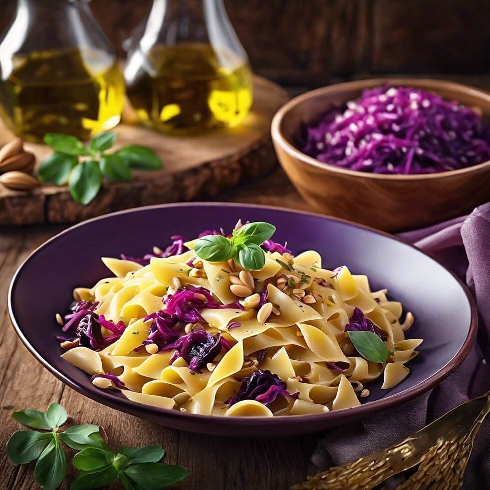

# **Pasta con Cavolo Rosso e Fagioli** - Ingredienti: pasta, cavolo rosso, fagioli

**Pasta con Cavolo Rosso e Fagioli** - Ingredienti: pasta, cavolo rosso, fagioli cannellini, aglio, olio d’oliva, pinoli. - Preparazione: cuocere la pasta, saltare il cavolo e i fagioli in padella, unire la pasta e servire con pinoli. **Preparazione**: Cuocere la pasta in acqua salata. In una padella, scaldare l’olio d’oliva e aggiungere aglio tritato, cavolo rosso tagliato a strisce e fagioli cannellini. Saltare per alcuni minuti fino a quando il cavolo è tenero. Scolare la pasta e unirla al composto in padella. Mescolare e servire con pinoli tostati.

---

*Ricetta da @leguminando*
