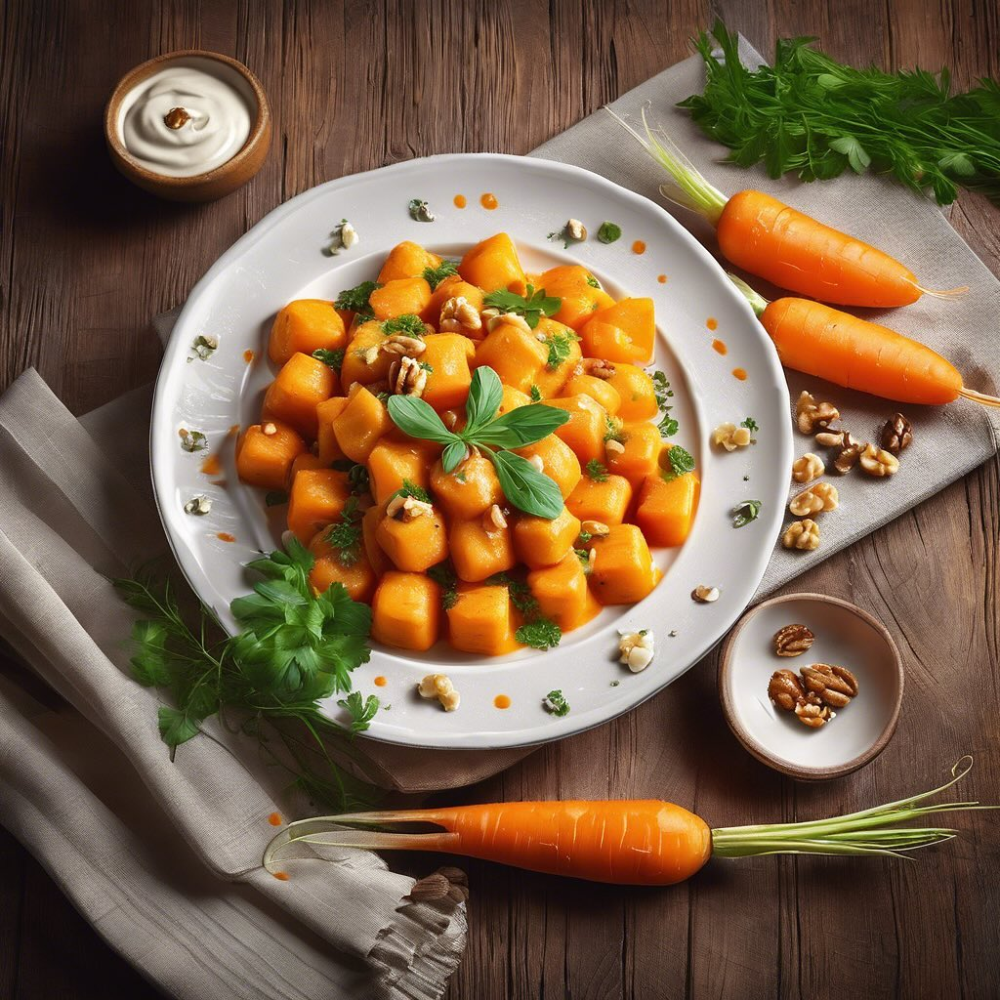

# #### Per gli gnocchi: - 400 g di carote - 150 g di farina di lenticchie - 1 uovo

#### Per gli gnocchi: - 400 g di carote - 150 g di farina di lenticchie - 1 uovo (opzionale) - Sale q.b. - Pepe q.b. - Noce moscata (facoltativa) #### Per la salsa al gorgonzola: - 150 g di gorgonzola - 200 ml di panna fresca - 1 cucchiaio di burro - Pepe nero q.b. - Noci tritate (per guarnire, facoltativo) ### Procedimento #### Preparazione degli gnocchi: 1. **Cuocere le carote**: Sbucciare e tagliare le carote a rondelle. Cuocerle in acqua bollente salata per circa 15 minuti, finché non saranno tenere. 2. **Schiacciare le carote**: Scolare le carote e schiacciarle con una forchetta o un passaverdura fino a ottenere un purè liscio. 3. **Mescolare gli ingredienti**: In una ciotola, unire il purè di carote con la farina di lenticchie, l’uovo (se si usa), sale, pepe e noce moscata. Mescolare fino a ottenere un impasto omogeneo. 4. **Formare gli gnocchi**: Spolverare un piano di lavoro con un po’ di farina di lenticchie. Prendere una porzione di impasto e formare un rotolo di circa 2 cm di diametro. Tagliare il rotolo in piccoli pezzi di circa 2-3 cm. Se desiderato, rigare gli gnocchi con una forchetta per ottenere la classica forma. 5. **Cottura**: Cuocere gli gnocchi in acqua bollente salata. Sono pronti quando salgono in superficie (circa 2-3 minuti). Scolarli e tenerli da parte. #### Preparazione della salsa al gorgonzola: 1. **Sciogliere il burro**: In una pentola, sciogliere il burro a fuoco medio. 2. **Aggiungere il gorgonzola**: Unire il gorgonzola a pezzetti e mescolare finché non si scioglie. 3. **Incorporare la panna**: Aggiungere la panna fresca e mescolare bene fino a ottenere una salsa cremosa. Aggiustare di pepe a piacere. #### Completamento del piatto: 1. **Unire gli gnocchi alla salsa**: Aggiungere gli gnocchi cotti alla salsa al gorgonzola e mescolare delicatamente per farli insaporire. 2. **Servire**: Distribuire gli gnocchi nei piatti e guarnire con noci tritate, se desiderato.

---

*Ricetta da @leguminando*
