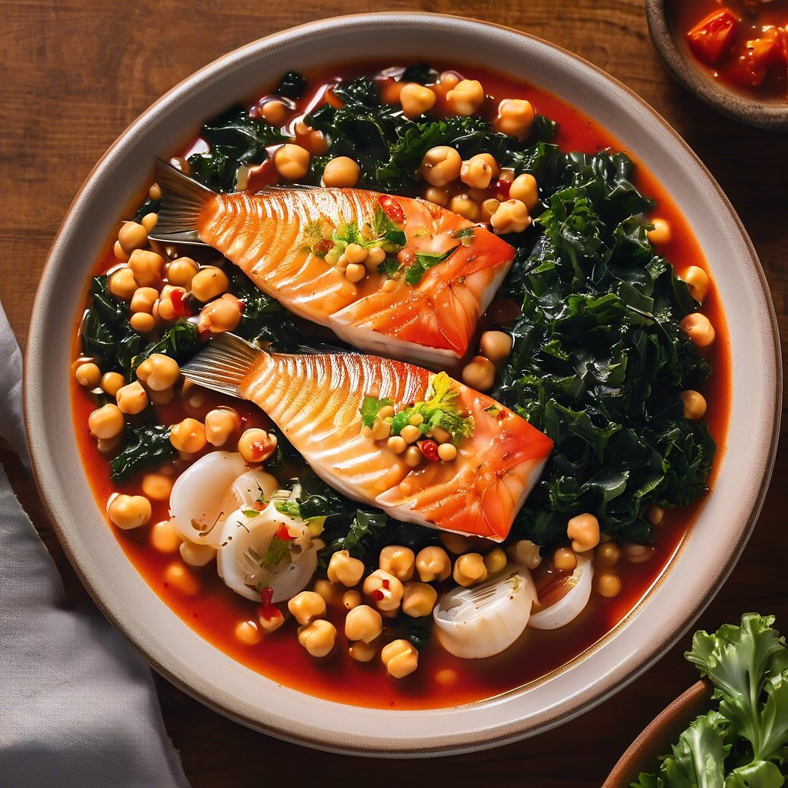

# #### Per la pasta: - 200 g di farina di lenticchie - 2 uova - Un pizzico di sale

#### Per la pasta: - 200 g di farina di lenticchie - 2 uova - Un pizzico di sale - Acqua q.b. (se necessaria) #### Per il condimento: - 300 g di gamberoni, sgusciati e puliti - 200 g di asparagi selvatici, puliti e tagliati a pezzi - 2 spicchi d’aglio, tritati - 50 ml di vino bianco secco - Olio extravergine di oliva - Sale e pepe q.b. - Prezzemolo fresco, tritato (per guarnire) - Limone (per servire) ### Procedimento #### Preparazione della pasta: 1. In una ciotola, mescola la farina di lenticchie e il sale. 2. Forma una fontana al centro e aggiungi le uova. Inizia a mescolare con una forchetta, incorporando progressivamente la farina. 3. Se l’impasto risulta troppo secco, aggiungi un po’ d’acqua. Impasta fino a ottenere una consistenza liscia e elastica. 4. Avvolgi l’impasto nella pellicola trasparente e lascialo riposare per 30 minuti. #### Preparazione del condimento: 1. In una padella grande, scalda un filo d’olio extravergine di oliva a fuoco medio. 2. Aggiungi l’aglio tritato e fallo rosolare leggermente. 3. Unisci i gamberoni e cuocili per circa 2-3 minuti, fino a quando diventano rosa. 4. Flambé: versa il vino bianco nella padella e accendi con cautela, lasciando evaporare l’alcol. 5. Aggiungi gli asparagi selvatici e cuoci per altri 5-7 minuti, fino a quando sono teneri. Aggiusta di sale e pepe. #### Cottura della pasta: 1. Porta a ebollizione una pentola d’acqua salata. Stendi la pasta con un mattarello o con una macchina per la pasta fino a uno spessore di circa 2 mm. 2. Taglia la pasta nella forma desiderata (tagliatelle, fettuccine, ecc.). 3. Cuoci la pasta in acqua bollente per 2-3 minuti, fino a quando è al dente. Scolala e condiscila immediatamente con il condimento di gamberoni e asparagi.

---

*Ricetta da @leguminando*
