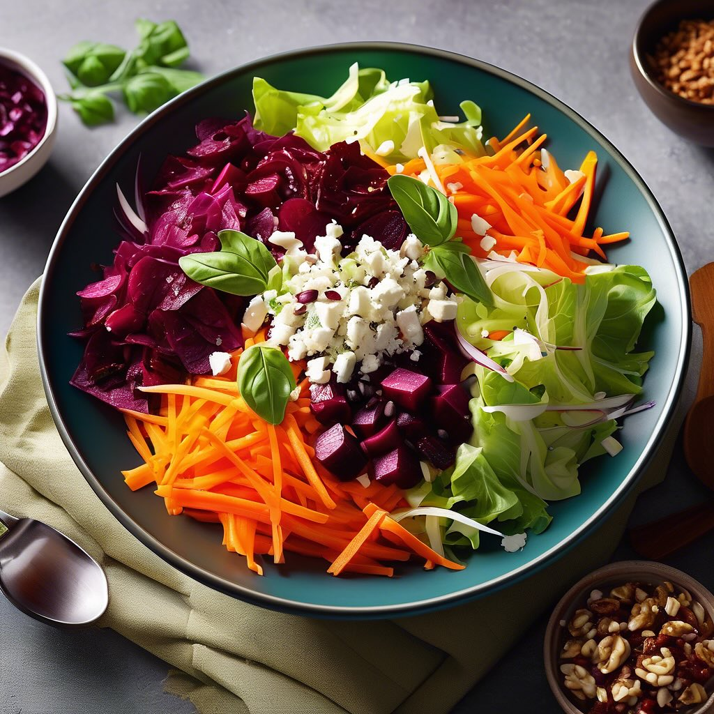

# ### Per le polpette: - 200 g di ceci secchi (o una lattina di ceci già cotti) - 

### Per le polpette: - 200 g di ceci secchi (o una lattina di ceci già cotti) - 200 g di carne macinata (manzo o pollo) - 1 radicchio rosso piccolo, cotto e tritato - 2 spicchi d’aglio, tritati - 1 uovo - 100 g di pangrattato - 50 g di parmigiano grattugiato (opzionale) - Sale e pepe q.b. - Olio extravergine d’oliva q.b. - Prezzemolo tritato (opzionale) #### Per i broccoli e barbe rosse: - 300 g di broccoli - 200 g di barbe rosse - Sale q.b. - Olio extravergine d’oliva q.b. - Limone (per servire, opzionale) ### Procedimento: 1. **Preparazione dei ceci**: Se utilizzi ceci secchi, mettili a bagno per almeno 8 ore e poi lessali fino a quando sono teneri. Se usi ceci in scatola, scolali e sciacquali. 2. **Preparazione delle polpette**: - In una ciotola grande, unisci i ceci macinati (puoi usare un frullatore per ottenere una consistenza fine), la carne macinata, il radicchio cotto, l’aglio tritato, l’uovo, il pangrattato e il parmigiano (se lo usi). - Mescola bene fino a ottenere un composto omogeneo. Aggiusta di sale e pepe. - Forma delle polpette della dimensione di una pallina da golf. 3. **Impanatura**: - Passa le polpette nel pangrattato per ricoprirle uniformemente. 4. **Cottura**: - Pre-riscalda il forno a 200°C. Fodera una teglia con carta da forno e spennella leggermente con olio d’oliva. - Disponi le polpette sulla teglia e spennellale con un po’ d’olio. - Cuoci in forno per circa 25-30 minuti, girandole a metà cottura, fino a quando sono dorate e croccanti. 5. **Preparazione dei broccoli e barbe rosse**: - Porta a ebollizione una pentola d’acqua salata e lessa i broccoli per circa 5-7 minuti, fino a quando sono teneri ma ancora croccanti. Scolali e mettili da parte. - In un’altra pentola, lessa le barbe rosse per circa 10-15 minuti finché non sono tenere. Scolale e condiscile con un filo d’olio d’oliva e un pizzico di sale. 6. **Impiattamento**: - Servi le polpette calde accompagnate dai broccoli lessi e dalle barbe rosse. Puoi aggiungere una spruzzata di limone per un tocco di freschezza.

---

*Ricetta da @leguminando*
