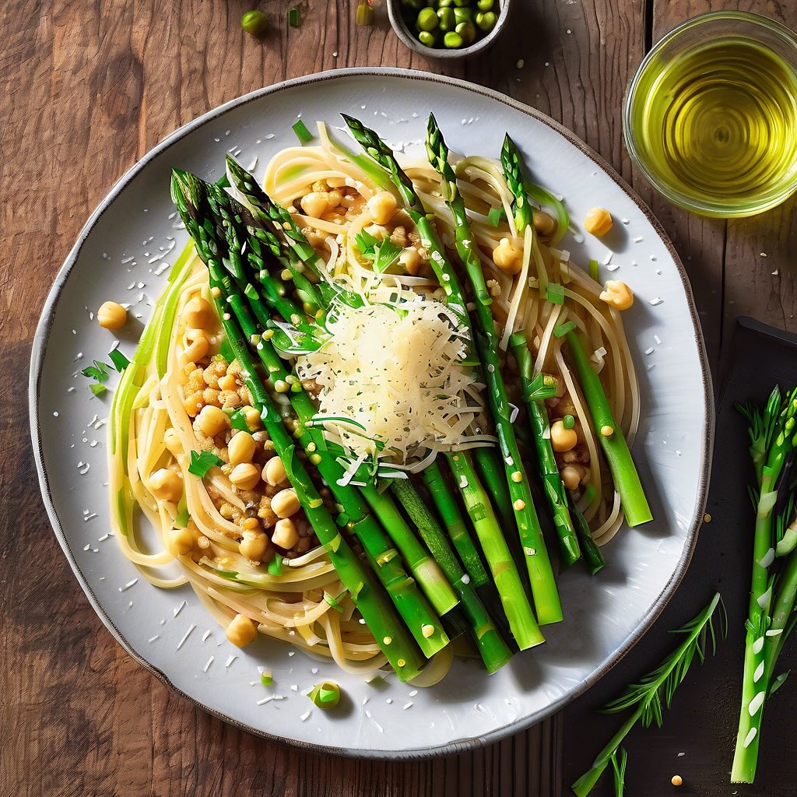

# ### Piatto di Piselli, Asparagi, Fave e Ravanelli con Crema di Yogurt e Senape #

### Piatto di Piselli, Asparagi, Fave e Ravanelli con Crema di Yogurt e Senape #### Ingredienti: - 600 g di piselli freschi (circa 150 g al netto dei baccelli) - 120 g di punte di asparagi - 600 g di fave (circa 90 g al netto dei baccelli) - 100 g di ravanelli (circa 10) - 1 cipollotto fresco - 70 g di rucola - **Per la crema:** - 1 cucchiaino di senape forte - Il succo di ½ limone - 1 cucchiaio di yogurt intero - 5 cucchiai di olio extravergine di oliva - Sale e pepe q.b. #### Procedimento: 1. **Preparazione delle verdure**: - Inizia lavando i piselli e le fave. Se non hai già le fave sbucciate, rimuovi i baccelli e metti da parte i semi. - Pulisci i ravanelli e tagliali a fette sottili. Affetta finemente il cipollotto e mettilo da parte. - Pulire e tagliare le punte di asparagi a pezzetti di circa 3-4 cm. 2. **Cottura delle verdure**: - Porta a ebollizione una pentola con acqua salata. Aggiungi i piselli e le fave e cuoci per circa 3-5 minuti, fino a quando sono teneri. Scolali e mettili in una ciotola di acqua ghiacciata per fermare la cottura. - Nella stessa acqua, cuoci le punte di asparagi per circa 2-3 minuti, quindi scolale e raffreddale in acqua ghiacciata. 3. **Preparazione della crema**: - In una ciotola, unisci la senape, il succo di limone, lo yogurt, l’olio extravergine di oliva, sale e pepe. Mescola bene fino a ottenere una crema omogenea. 4. **Assemblaggio del piatto**: - In una ciotola grande, unisci i piselli, le fave, le punte di asparagi, i ravanelli, il cipollotto e la rucola. Mescola delicatamente per combinare gli ingredienti. 5. **Servizio**: - Servi le verdure fresche in un piatto e guarnisci con la crema di yogurt e senape. Puoi anche aggiungere un filo d’olio d’oliva extra per un tocco finale.

---

*Ricetta da @leguminando*
