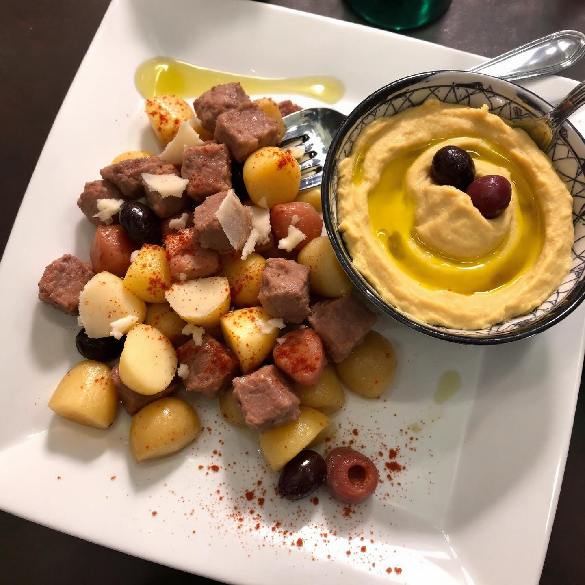

# **Polpette di vitello, patate e parmigiano con hummus di ceci e olive** **Ingred

**Polpette di vitello, patate e parmigiano con hummus di ceci e olive** **Ingredienti Polpette:** - 400 g carne di vitello macinata - 200 g patate - 80 g Parmigiano grattugiato - 1 uovo - Aglio, prezzemolo, sale, pepe - Pangrattato q.b. - Olio evo per cottura **Ingredienti Hummus:** - 250 g ceci cotti - 50 g olive nere - 1 cucchiaio tahina - Succo di 1 limone - Aglio, olio evo, sale, pepe **Procedimento:** 1. **Patate:** Cuoci, schiaccia e raffredda. 2. **Impasto Polpette:** Mescola carne, patate, parmigiano, uovo, aglio, prezzemolo, sale, pepe. Aggiungi pangrattato se necessario. 3. **Formare e Cuocere:** Crea e cuoci polpette in padella con olio. 4. **Hummus:** Frulla ceci, olive, tahina, limone, aglio, olio. Condisci. 5. **Servizio:** Polpette con hummus in ciotolina. Guarnisci con olio e paprika.

---

*Ricetta da @leguminando*
