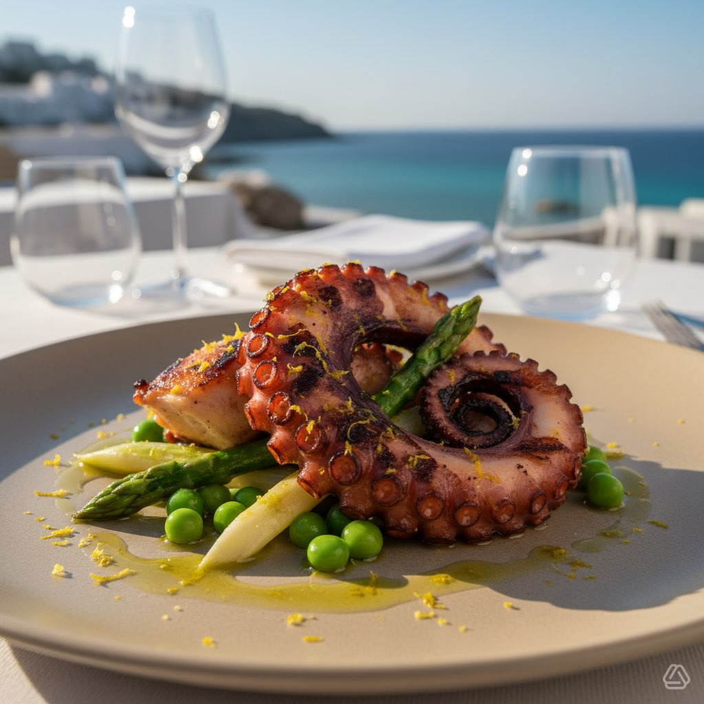

# Polpo croccante su letto di asparagi e piselli novelli Ricetta Ingredienti (per 

Polpo croccante su letto di asparagi e piselli novelli Ricetta Ingredienti (per 2 persone) - 400 g di polpo fresco (già bollito o da cuocere) - 200 g di asparagi freschi - 150 g di piselli novelli (freschi o surgelati) - 100 g di carotine baby - 1 limone biologico (scorza e succo) - 30 ml di olio extravergine d’oliva - 3–4 rametti di timo fresco - 4–5 foglie di menta fresca - Sale Maldon (in fiocchi) e pepe nero q.b. - 1 cucchiaino di burro chiarificato (~5 g) Preparazione 1. Polpo: se crudo, cuoci il polpo in acqua con un filo d’olio e il timo a fuoco dolce finché non risulta tenero (i tempi variano con la taglia). Scolalo, asciugalo e passalo sulla piastra ben calda con il burro chiarificato fino a doratura e croccantezza dei tentacoli. Se il polpo è già bollito, procedi direttamente con la doratura. 2. Verdure: sbollenta le punte e la parte tenera degli asparagi e i piselli in acqua salata per circa 2–3 minuti; raffredda subito in acqua e ghiaccio per preservare il colore. In una padella scalda un filo d’olio e salta le carotine baby con la menta per circa 4–5 minuti, finché risultano tenere ma non molli. 3. Composizione: disponi al centro del piatto un letto di asparagi e piselli; adagia sopra i tentacoli di polpo dorati. Guarnisci con le carotine baby, scorza di limone grattugiata, un filo d’olio a crudo, sale Maldon e pepe nero. Aggiungi qualche goccia di succo di limone al momento di servire, se gradito. Valori nutrizionali stimati (totale ricetta e per porzione; stima approssimativa) - Dosi: 2 porzioni - Totale ricetta (circa): KPGC: 830 kcal / 71 g proteine / 38 g grassi / 51 g carboidrati - Per porzione (1/2 ricetta): KPGC: 415 kcal / 36 g proteine / 19 g grassi / 25 g carboidrati

---

*Ricetta da @leguminando*
