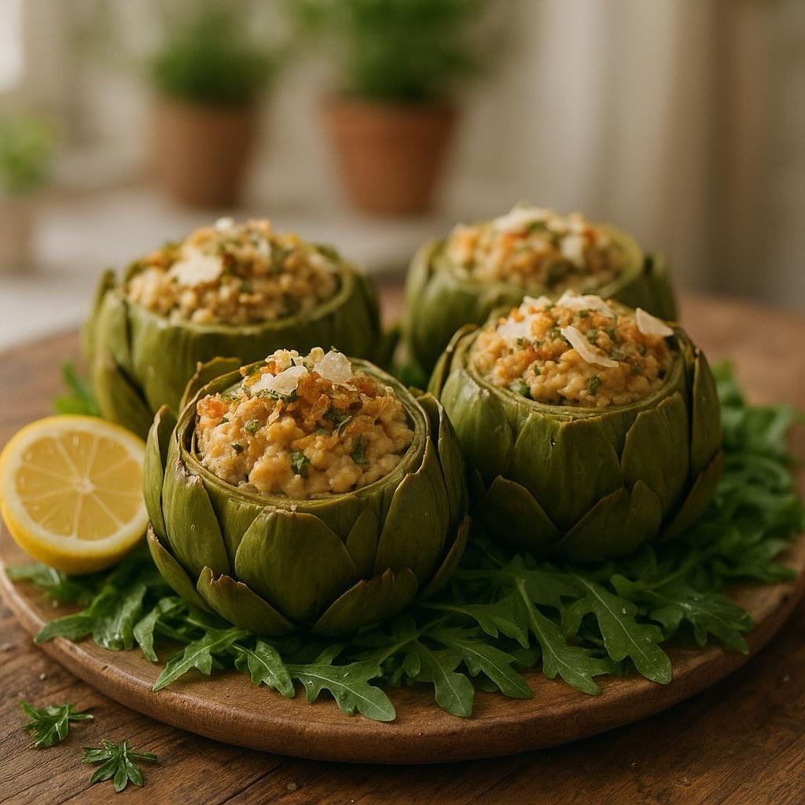

# ### Procedura per i Carciofi Ripieni di Ceci ## Preparazione dei Carciofi 1

### Procedura per i Carciofi Ripieni di Ceci ## Preparazione dei Carciofi 1. **Pulizia dei Carciofi**: - Rimuovi le foglie esterne più dure. - Taglia le punte spinose e svuota per formare un cestino. - Immergi i carciofi in acqua acidulata con succo di limone per evitare che anneriscano. 2. **Cottura dei Carciofi**: - Porta a ebollizione una pentola d&#039;acqua con un cucchiaio di farina e un po&#039; di sale. - Cuoci i carciofi per circa 10-15 minuti finché non sono teneri ma ancora sodi. - Scolali e lasciali raffreddare. Preparazione del Ripieno di Ceci 1. **Soffritto di Base**: - In una padella, scalda l&#039;olio extravergine e soffriggi il cipollotto e l’aglio tritati finemente. 2. **Miscela di Ceci**: - Aggiungi i ceci scolati al soffritto e cuoci per qualche minuto. - Trasferisci il tutto in un mixer, aggiungi l&#039;erba cipollina, il pecorino (o tofu), il pangrattato, l&#039;uovo ed il mix di semi di lino), la scorza di limone, sale, pepe e noce moscata. - Frulla fino a ottenere un composto omogeneo. 3. **Riempimento**: - Riempi i carciofi con il ripieno di ceci, pressando leggermente. Preparazione del Crumble Aromatico 1. **Crumble**: - Mescola il pangrattato, il pecorino, l&#039;olio, il prezzemolo e la menta. - Distribuisci il crumble sopra i carciofi ripieni. Cottura Finale 1. **Gratinatura**: - Posiziona i carciofi ripieni in una teglia e cuoci in forno preriscaldato a 180°C per circa 20 minuti, finché il crumble è dorato. Servizio 1. **Impiattamento**: - Disponi i carciofi su un letto di rucola fresca. - Condisci con scaglie di parmigiano, un filo d’olio a crudo, una spolverata di scorza di limone e pepe nero macinato al momento.

---

*Ricetta da @leguminando*
