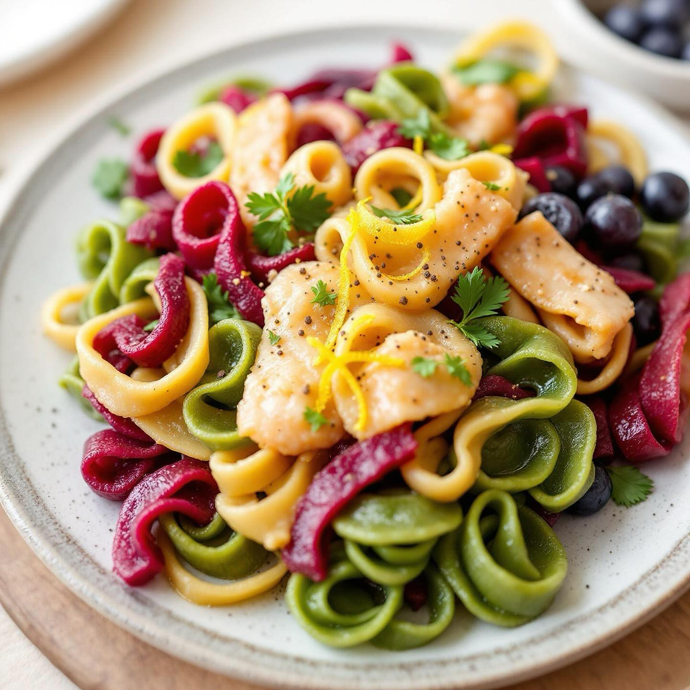

# Ricetta (4 persone) — Maltagliati tricolori di ceci, lenticchie e quinoa con sal

Ricetta (4 persone) — Maltagliati tricolori di ceci, lenticchie e quinoa con salsa di pesce spada affumicato al burro e Prosecco Ingredienti - Per la pasta (totale ~600 g farina): 200 g farina di ceci, 150 g farina di lenticchie, 150 g farina di quinoa; 4 uova grandi; 2–3 cucchiai olio d’oliva; sale q.b. - Per la versione verde: 120 g spinaci freschi sbollentati, strizzati e frullati (sostituiscono parte dell’uovo/aggiunti come liquido). - Per la versione rossa: 120 g purea di barbabietola rossa cotta (come sopra). - Per il sugo: 200 g pesce spada affumicato a tranci, 80 g burro, 120 ml Prosecco, 1 scalogno piccolo tritato, pepe nero, scorza limone, prezzemolo tritato. - Olio evo per condire, sale. Preparazione 1. Impasti: dividi le farine in tre parti uguali (circa 200 g ciascuna: ceci, lenticchie, quinoa). Per ogni colore prepara un impasto da ~200 g farina + 1 uovo (o equivalente liquido). - Impasto naturale: 200 g farina mista (un terzo di ciascuna), 1 uovo, 1 cucchiaino olio, pizzico di sale, acqua se serve. - Verde: 200 g farina mista, 1 uovo + 2–3 cucchiai purea di spinaci (regola liquidi), sale, olio. - Rosso: 200 g farina mista, 1 uovo + 2–3 cucchiai purea di barbabietola, sale, olio. Impasta fino a ottenere sfoglie compatte e non appiccicose. Avvolgi in pellicola e riposa 20–30 min. Salsa: in padella larga sciogli il burro, aggiungi lo scalogno e fai appassire. Aggiungi il pesce spada affumicato sminuzzato e rosola brevemente. Sfuma con il Prosecco, lascia evaporare 2–3 min. Aggiusta di pepe, non troppo sale (il pesce è sapido). A fuoco spento aggiungi scorza di limone e prezzemolo. Mantieni la salsa calda. Mantecatura e impiattamento: unisci la pasta scolata nella padella con la salsa, aggiungi una noce di burro se serve e poca acqua di cottura per emulsionare. Completa con pepe, un filo d’olio evo e qualche scaglia sottile di scorza di limone.

---

*Ricetta da @leguminando*
