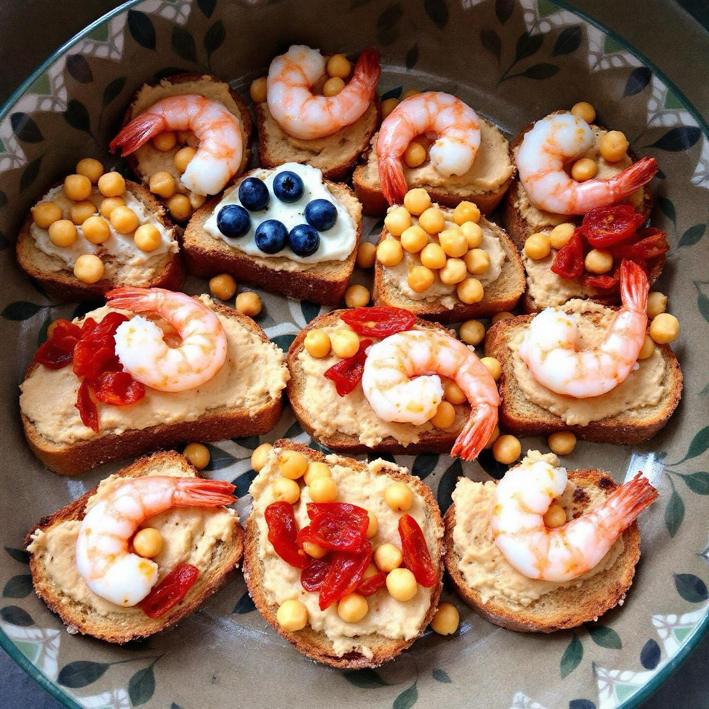

# ### Ricetta: Crostoni di Pane con Humus di Ceci e Gamberetti #### Ingredienti: -

### Ricetta: Crostoni di Pane con Humus di Ceci e Gamberetti #### Ingredienti: - **Per l’humus di ceci:** - 200 g di ceci (cotti) - Succo di 1 lime - 2 cucchiai di tahini - 1 spicchio d’aglio - Olio extravergine d’oliva q.b. - Sale e pepe q.b. - **Per i ceci croccanti:** - 100 g di ceci (cotti) - Olio extravergine d’oliva q.b. - Paprika affumicata q.b. - Sale q.b. - **Per i crostoni:** - Fette di pane (tipo ciabatta o baguette) - Olio extravergine d’oliva q.b. - **Per la guarnizione:** - Pomodori secchi (a piacere) - Gamberetti sgusciati e scottati in acqua e lime #### Preparazione: 1. **Preparare l’humus di ceci:** - In un frullatore, unire i ceci cotti, il succo di lime, il tahini, l’aglio, un filo d’olio, sale e pepe. Frullare fino a ottenere una crema liscia. Se necessario, aggiungere un po’ d’acqua per raggiungere la consistenza desiderata. 2. **Preparare i ceci croccanti:** - Preriscaldare il forno a 200°C. Scolare i ceci e asciugarli bene. Disporli su una teglia da forno, condirli con olio, paprika affumicata e sale. Cuocere in forno per circa 20-25 minuti, fino a quando non diventano croccanti. 3. **Preparare i crostoni:** - Preriscaldare il forno a 180°C. Spennellare le fette di pane con un po’ d’olio e tostarle in forno per circa 10 minuti, fino a doratura. 4. **Cuocere i gamberetti:** - In una pentola, portare a ebollizione dell’acqua con succo di lime. Aggiungere i gamberetti e scottarli per 2-3 minuti fino a quando non diventano rosa. Scolarli e metterli da parte. 5. **Assemblare il piatto:** - Spalmare un generoso strato di humus di ceci su ciascun crostone. Aggiungere i ceci croccanti, i pomodori secchi e i gamberetti scottati.

---

*Ricetta da @leguminando*
