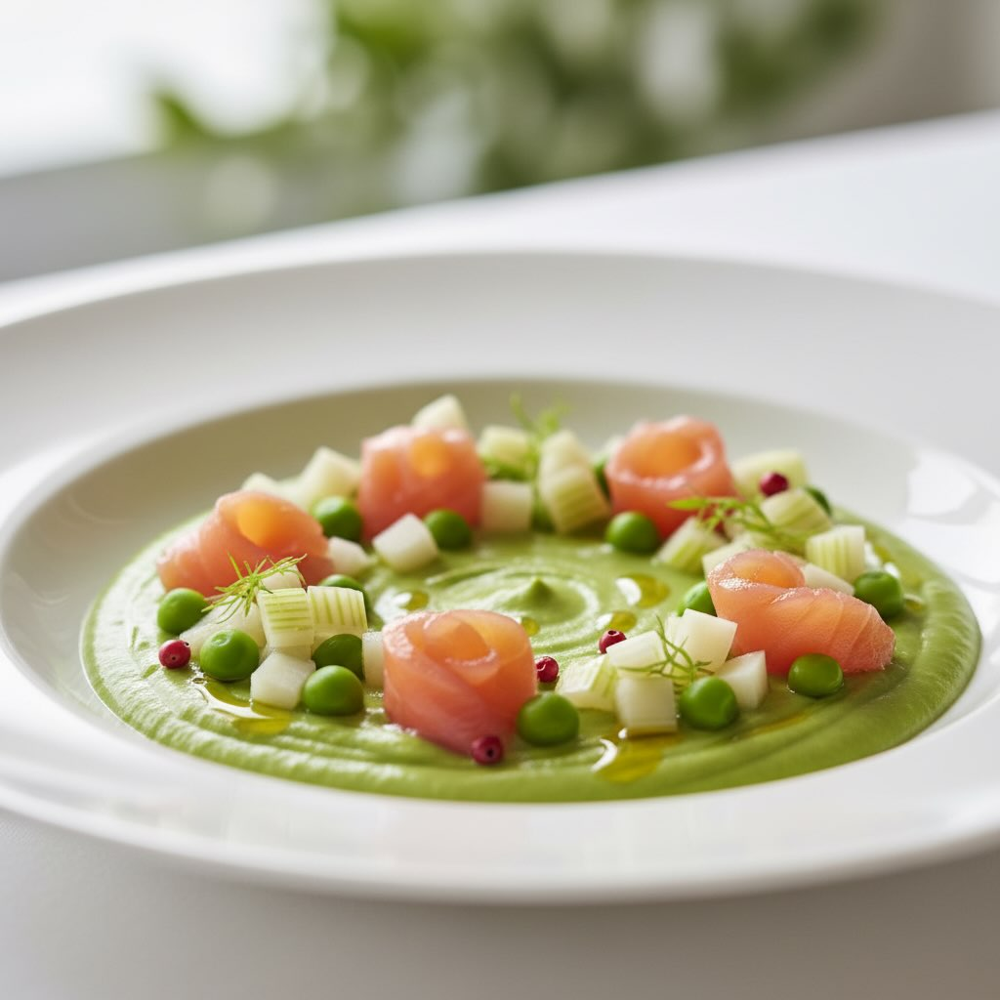

# Salmone Affumicato su Finocchio Marinato e Crema di Piselli Ingredienti (2 perso

Salmone Affumicato su Finocchio Marinato e Crema di Piselli Ingredienti (2 persone): - 150g salmone affumicato (a fette o pezzetti, non cuocere) - 1 finocchio grande (a dadini sottili, marinato crudo) - 200g piselli (per crema vellutata) - Olio EVO, succo di 1/2 limone - Pepe rosa in grani, paprica dolce, sale Salmone affumicato su finocchio marinato e crema di piselli. Eleganza primaverile in un piatto, perfetto con un bianco frizzante. Alto contenuto proteico (salmone + piselli), fibre dal finocchio, omega-3, stagionale primavera, leggero ma nutriente. #leguminando #Leguminando

---

*Ricetta da @leguminando*
