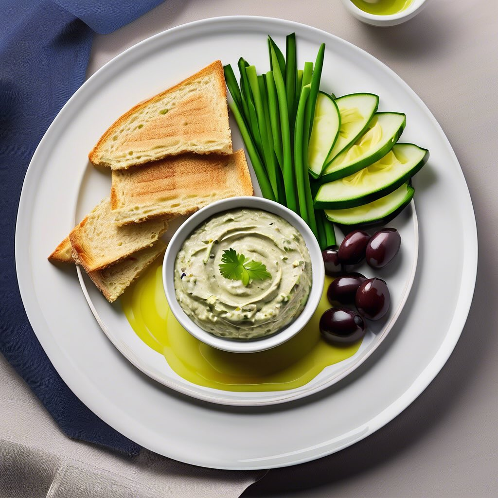

# ### Salsa di Tonno e Fagioli **Ingredienti:** - 150 g di tonno in scatola (sgocc

### Salsa di Tonno e Fagioli **Ingredienti:** - 150 g di tonno in scatola (sgocciolato) - 200 g di fagioli cannellini (cotti e scolati) - Succo di 1 limone - Sale e pepe q.b. - Un filo d’olio d’oliva **Preparazione:** 1. In una ciotola, unisci il tonno, i fagioli e il succo di limone. 2. Aggiungi un pizzico di sale e pepe a piacere e un filo d’olio d’oliva. 3. Frulla il tutto con un mixer fino a ottenere una crema liscia e omogenea. 4. Se la salsa risulta troppo densa, puoi aggiungere un po’ d’acqua o ulteriore olio d’oliva per raggiungere la consistenza desiderata. ### Salsa di Porri e Zucchine **Ingredienti:** - 1 porro (solo la parte bianca) - 1 zucchina media - Sale e pepe q.b. - Un filo d’olio d’oliva **Preparazione:** 1. Pulisci il porro e taglialo a rondelle. Lava e taglia la zucchina a cubetti. 2. In una padella, scalda un filo d’olio d’oliva e aggiungi il porro. Cuoci a fuoco medio finché diventa morbido. 3. Aggiungi le zucchine e continua a cuocere per altri 5-7 minuti, finché anche le zucchine sono tenere. Aggiusta di sale e pepe. 4. Trasferisci il composto in un frullatore e frulla fino a ottenere una crema liscia. ### Impiattamento 1. Versa le due salse in piccole ciotole decorative. 2. Decora con alcune olive nere o verdi sopra le salse per un tocco di colore. 3. Servi le salse con fette di pane tostato disposte intorno al piatto.

---

*Ricetta da @leguminando*
