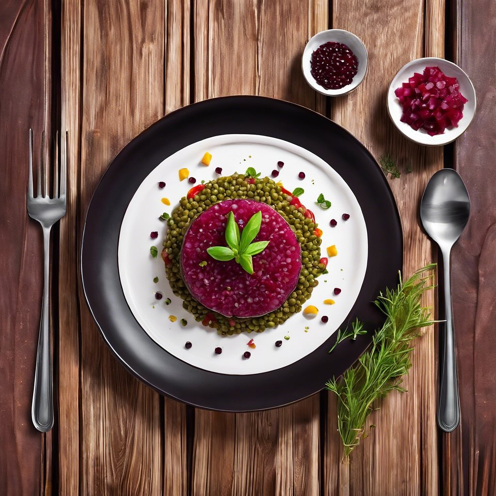

# San Silvestro!! Ecco una deliziosa ricetta per una tartare con lenticchie, rape 

San Silvestro!! Ecco una deliziosa ricetta per una tartare con lenticchie, rape rosse, capperi, acciughe sotto l’olio e senape. ### Ingredienti: - 200 g di lenticchie (preferibilmente piccole, come le lenticchie verdi o nere) - 2 rape rosse medie - 1 cucchiaio di capperi sott’aceto - 4-5 acciughe sott’olio - 1 cucchiaio di senape di Digione - Succo di limone q.b. - Olio extravergine d’oliva q.b. - Sale e pepe q.b. - Erbe fresche (come prezzemolo o basilico) per guarnire ### Procedimento: 1. **Preparare le lenticchie**: Metti le lenticchie in una pentola con acqua fredda e porta a ebollizione. Cuoci per circa 20-25 minuti, o fino a quando sono tenere. Scolale e lasciale raffreddare. 2. **Cuocere le rape rosse**: Lessare le rape rosse in acqua salata per circa 30-40 minuti, fino a quando saranno tenere. Una volta cotte, scolale, lasciale raffreddare e poi sbucciale. Tagliale a cubetti piccoli. 3. **Preparare il condimento**: In una ciotola, unisci i capperi, le acciughe tritate finemente, la senape, un filo d’olio extravergine d’oliva e il succo di limone. Mescola bene per amalgamare gli ingredienti. Aggiusta di sale e pepe. 4. **Unire gli ingredienti**: In una ciotola grande, mescola le lenticchie raffreddate con i cubetti di rapa rossa. Aggiungi il condimento preparato e mescola delicatamente per non rompere le lenticchie. 5. **Impiattare**: Utilizza un coppapasta per formare delle porzioni di tartare nei piatti. Guarnisci con erbe fresche e un filo d’olio d’oliva a crudo. 6. **Servire**: La tartare è pronta per essere servita! Puoi accompagnarla con crostini di pane o gallette di riso per un tocco croccante.

---

*Ricetta da @leguminando*
