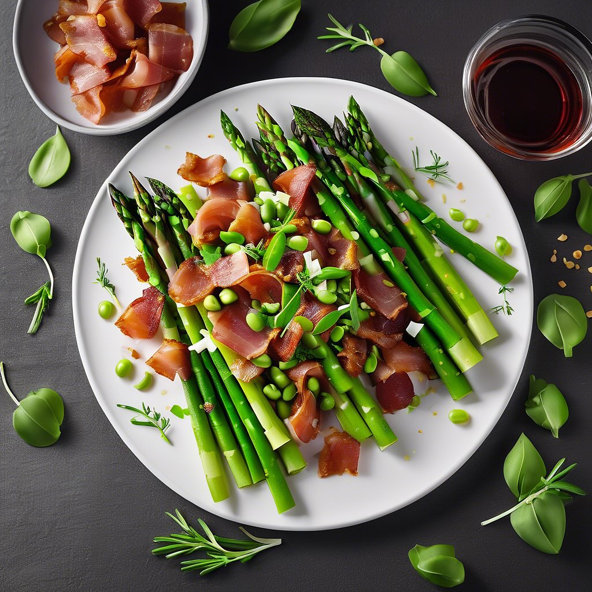

# ### Sformato di Formaggio Fresco Spalmabile e Radicchio Rosso con Crema di Pisel

### Sformato di Formaggio Fresco Spalmabile e Radicchio Rosso con Crema di Piselli #### Ingredienti: - 300 g di formaggio fresco spalmabile - 200 g di radicchio rosso - 3 uova - 100 g di panna fresca - 50 g di parmigiano grattugiato - Sale e pepe q.b. - 200 g di piselli freschi o surgelati - 1 cipolla piccola - Olio extravergine d’oliva q.b. - Erbe aromatiche (timo o prezzemolo) per guarnire #### Preparazione: 1. **Preparazione del radicchio**: - Lavate e tagliate a strisce il radicchio rosso. In una padella, scaldate un filo d’olio e fate rosolare la cipolla tritata finemente. Aggiungete il radicchio e fate cuocere a fuoco medio per circa 5-7 minuti, fino a quando si appassisce. Salate e pepate a piacere. Lasciate raffreddare. 2. **Preparazione del composto di formaggio**: - In una ciotola, sbattete le uova con la panna fresca. Aggiungete il formaggio spalmabile e mescolate bene fino ad ottenere un composto omogeneo. Incorporate il parmigiano grattugiato e il radicchio raffreddato. Mescolate fino a ottenere un composto ben amalgamato e aggiustate di sale e pepe. 3. **Cottura**: - Preriscaldate il forno a 180°C. Versate il composto in uno stampo da sformato precedentemente ungendo con un po’ d’olio. Cuocete in forno a bagnomaria per circa 40-50 minuti, finché il sformato non risulta dorato in superficie e sodo al tatto. Fate raffreddare a temperatura ambiente e poi in frigorifero per almeno un paio d’ore. 4. **Preparazione della crema di piselli**: - In un pentolino, portate a ebollizione dell’acqua salata e cuocete i piselli per circa 5 minuti. Scolateli e frullateli con un filo d’olio, aggiustando di sale e pepe fino a ottenere una crema liscia. Potete aggiungere un po’ di acqua di cottura se necessario per raggiungere la consistenza desiderata. 5. **Impiattamento**: - Una volta che lo sformato è freddo e sodo, sformatelo delicatamente su un piatto. Versate la crema di piselli attorno allo sformato e decorate con erbe aromatiche fresche. Servite il piatto ben fresco.

---

*Ricetta da @leguminando*
