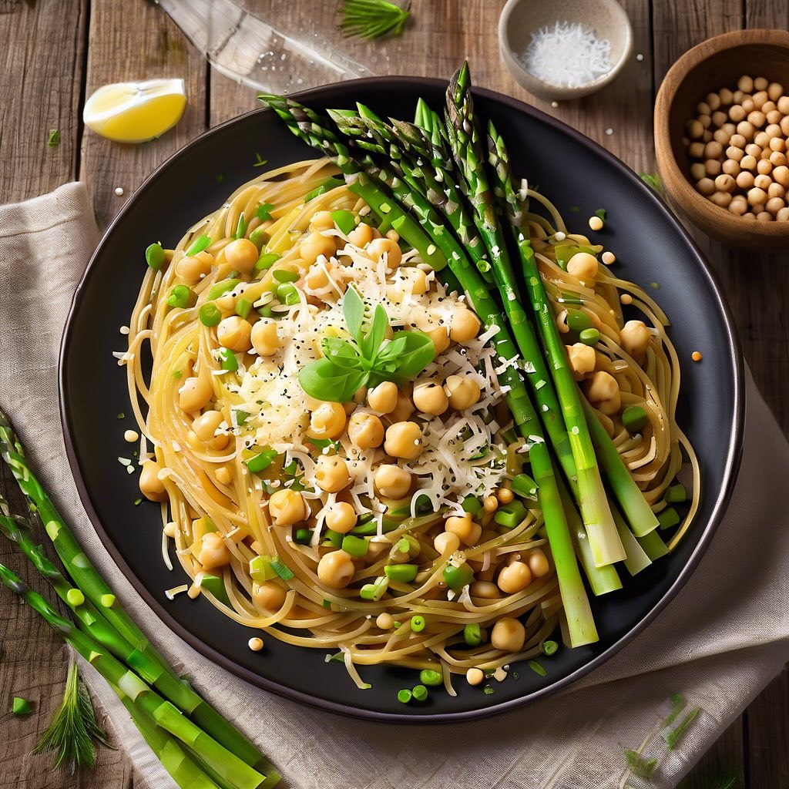

# ### Spaghetti integrali con ceci, porro e asparagi #### Ingredienti: - 320 g di 

### Spaghetti integrali con ceci, porro e asparagi #### Ingredienti: - 320 g di spaghetti integrali (meglio di grani antichi) - 200 g di ceci bolliti (puoi usare ceci in scatola, ben scolati) - 1 porro medio - Un mazzetto di asparagi - Salsa di soia (o tamari senza glutine) - Olio extravergine d’oliva (olio evo) - Sale marino integrale - Pepe nero (facoltativo) - Parmigiano grattugiato (facoltativo) #### Procedimento: 1. **Preparazione degli ingredienti:** - Lava il porro e affettalo finemente. - Pulisci gli asparagi, rimuovendo la parte legnosa e tagliali a rondelle, lasciando le punte intere. 2. **Cottura della pasta:** - Porta a ebollizione una pentola d’acqua salata. Cuoci gli spaghetti integrali seguendo le istruzioni sulla confezione, fino a quando sono al dente. 3. **Preparazione del condimento:** - In una padella capiente, scalda un filo d’olio evo a fuoco medio. - Aggiungi il porro affettato e fai rosolare fino a quando diventa morbido e traslucido (circa 5 minuti). - Unisci gli asparagi e continua a cuocere per altri 3-4 minuti, fino a quando diventano teneri. - Aggiungi i ceci bolliti e mescola bene. - Versa un paio di cucchiai di salsa di soia (o tamari) e mescola per amalgamare i sapori. Aggiusta di sale e pepe a piacere. 4. **Unione degli ingredienti:** - Quando gli spaghetti sono pronti, scolali e trasferiscili nella padella con il condimento. - Mescola bene per assicurarti che la pasta sia ben condita. 5. **Servizio:** - Servi subito, guarnendo con un filo d’olio evo a crudo e, se desideri, una spolverata di parmigiano grattugiato.

---

*Ricetta da @leguminando*
