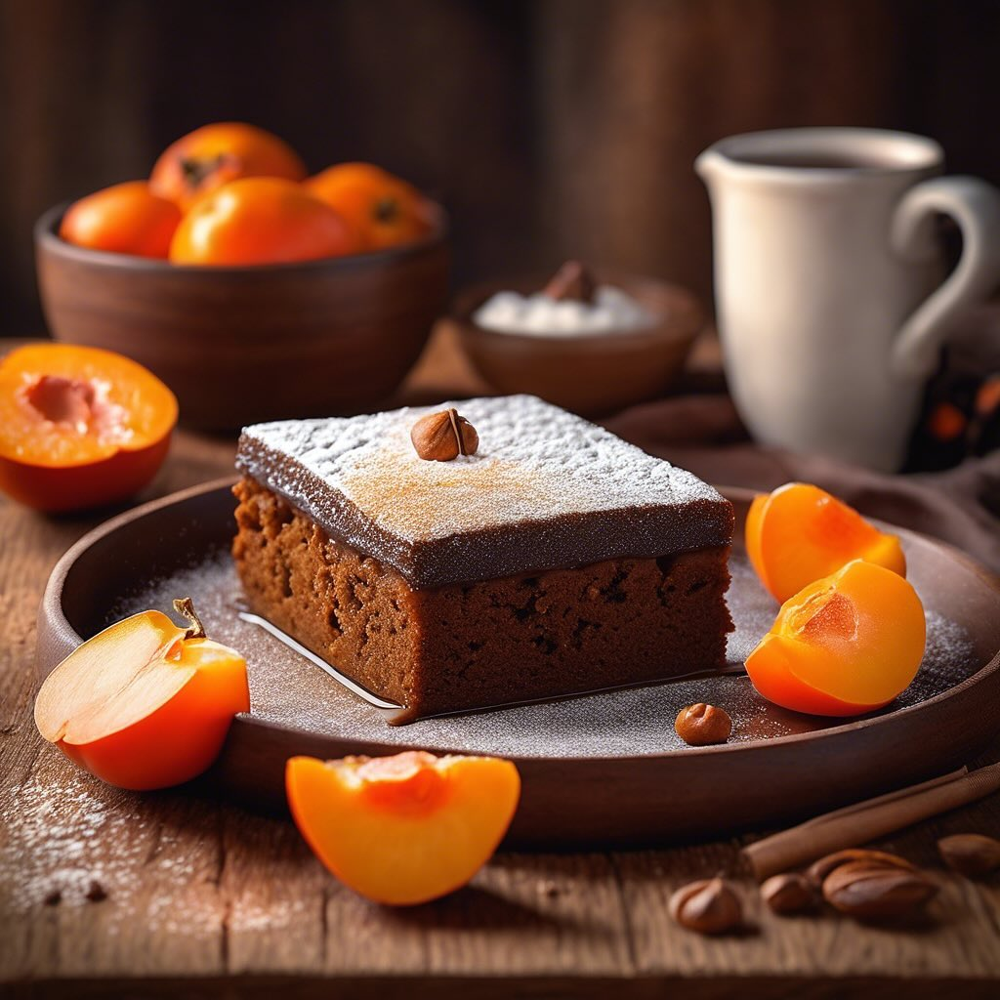

# ### Torta di Farina di Carrube e Crema di Cachi #### Ingredienti: - **Per la tor

### Torta di Farina di Carrube e Crema di Cachi #### Ingredienti: - **Per la torta:** - 150 g di farina di carrube - 100 g di zucchero di canna - 3 uova - 150 g di yogurt greco - 1 cucchiaino di lievito per dolci - 1 pizzico di sale - 50 ml di olio di semi (o olio d’oliva leggero) - 1 cucchiaino di estratto di vaniglia - **Per la crema di cachi:** - 2 cachi maturi - 2 cucchiai di zucchero (regolare a piacere) - Succo di mezzo limone - Un pizzico di cannella (opzionale) #### Procedimento: 1. **Preparare la crema di cachi:** - Sbucciare i cachi e frullarli in un mixer fino a ottenere una crema liscia. - Aggiungere lo zucchero, il succo di limone e la cannella (se desiderata). Mescolare bene e mettere da parte. 2. **Preparare la torta:** - Preriscaldare il forno a 180°C e imburrare o rivestire di carta forno una tortiera di 20-22 cm di diametro. - In una ciotola grande, sbattere le uova con lo zucchero fino a ottenere un composto chiaro e spumoso. - Aggiungere lo yogurt greco, l’olio e l’estratto di vaniglia, mescolando bene. - In un’altra ciotola, setacciare la farina di carrube, il lievito e il sale. Incorporare gradualmente gli ingredienti secchi nel composto umido, mescolando fino a ottenere un impasto omogeneo. 3. **Assemblare e cuocere:** - Versare metà dell’impasto nella tortiera, poi aggiungere uno strato di crema di cachi. Coprire con il resto dell’impasto. - Infornare per circa 30-35 minuti, o fino a quando uno stecchino inserito al centro esce pulito. - Una volta cotta, lasciare raffreddare la torta nella teglia per 10 minuti, poi trasferirla su una griglia per raffreddare completamente. 4. **Servire:** - Servire la torta a fette, eventualmente accompagnata da un po’ di crema di cachi sopra o a lato.

---

*Ricetta da @leguminando*
