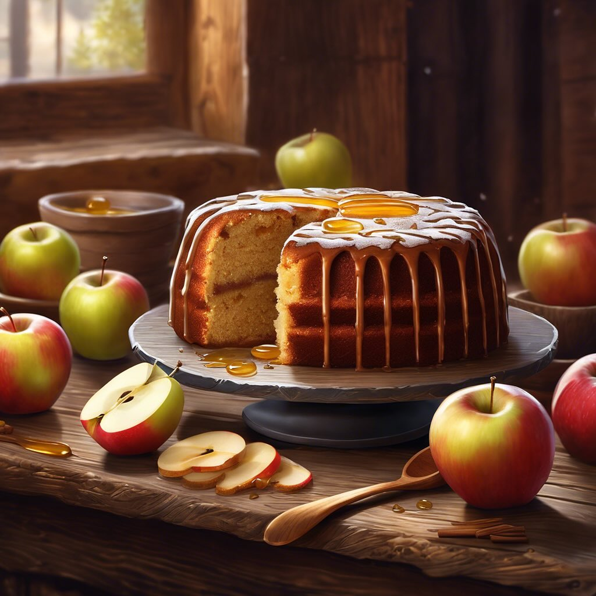

# ### Torta di Mele con Farina di Carrube #### Ingredienti - 200 g di farina di ca

### Torta di Mele con Farina di Carrube #### Ingredienti - 200 g di farina di carrube - 3 mele (preferibilmente dolci) - 100 g di miele - 3 uova - 200 ml di latte #### Istruzioni 1. **Preparazione delle mele**: Sbuccia le mele e tagliale a fette sottili. Puoi anche grattugiarle se preferisci una consistenza più omogenea. 2. **Preparazione dell’impasto**: In una ciotola capiente, sbatti le uova con il miele fino a ottenere un composto omogeneo. Aggiungi il latte e mescola bene. 3. **Incorporare la farina**: Setaccia la farina di carrube nel composto di uova, miele e latte. Mescola bene fino a ottenere un impasto liscio. 4. **Aggiungere le mele**: Incorpora le fette di mela all’impasto, mescolando delicatamente per distribuirle uniformemente. 5. **Cottura**: Versa il composto in una tortiera precedentemente unta o foderata con carta da forno. Cuoci in forno preriscaldato a 180°C per 30-35 minuti, o fino a quando la torta risulta dorata e uno stecchino inserito al centro esce pulito. 6. **Raffreddamento**: Lascia raffreddare la torta nella tortiera per 10 minuti, poi trasferiscila su una griglia per raffreddarla completamente.

---

*Ricetta da @leguminando*
