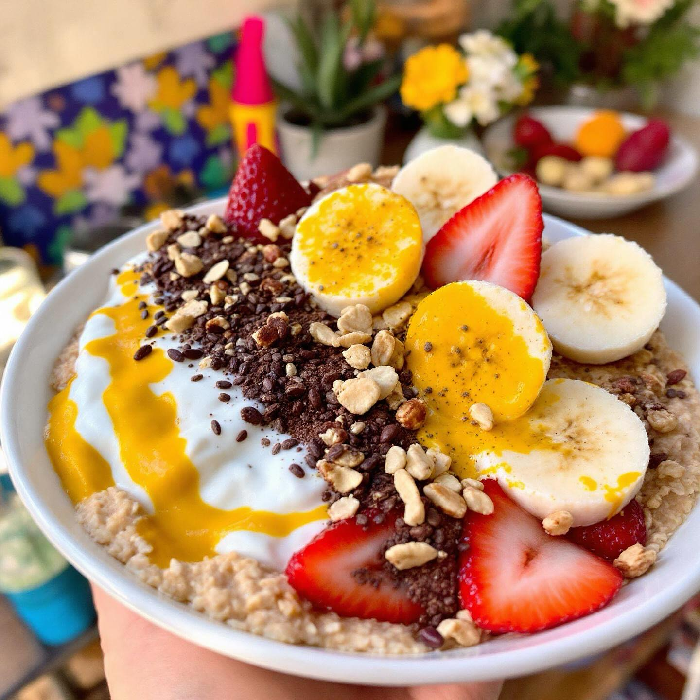

# ### Yogurt con Avena, Curcuma e Cacao #### Ingredienti: - 200 g di yogurt magro 

### Yogurt con Avena, Curcuma e Cacao #### Ingredienti: - 200 g di yogurt magro - 30 g di fiocchi di avena - 1 cucchiaio di curcuma in polvere - 1 cucchiaio di cacao amaro in polvere - 1 cucchiaino di miele (opzionale, per dolcificare) - Frutta fresca a piacere (banana, fragole, mirtilli) - Semi o frutta secca (noci, mandorle, semi di chia) per guarnire #### Istruzioni: 1. **Preparare la base**: In una ciotola, mescola lo yogurt magro con la curcuma in polvere e il cacao amaro. Aggiungi il miele se desideri un tocco di dolcezza. 2. **Aggiungere l&#039;avena**: Incorpora i fiocchi di avena nella miscela di yogurt. Mescola bene per assicurarti che siano distribuiti uniformemente. 3. **Servire**: Versa la miscela in una ciotola o in un bicchiere trasparente per un effetto visivo accattivante. 4. **Guarnire**: Aggiungi la frutta fresca di tua scelta e spolvera con semi o frutta secca per un tocco croccante. 5. **Riposare**: Se hai tempo, lascia riposare la combinazione in frigorifero per circa 10-15 minuti. Questo permette ai fiocchi di avena di assorbire parte dello yogurt e rendere il piatto più cremoso.

---

*Ricetta da @leguminando*
