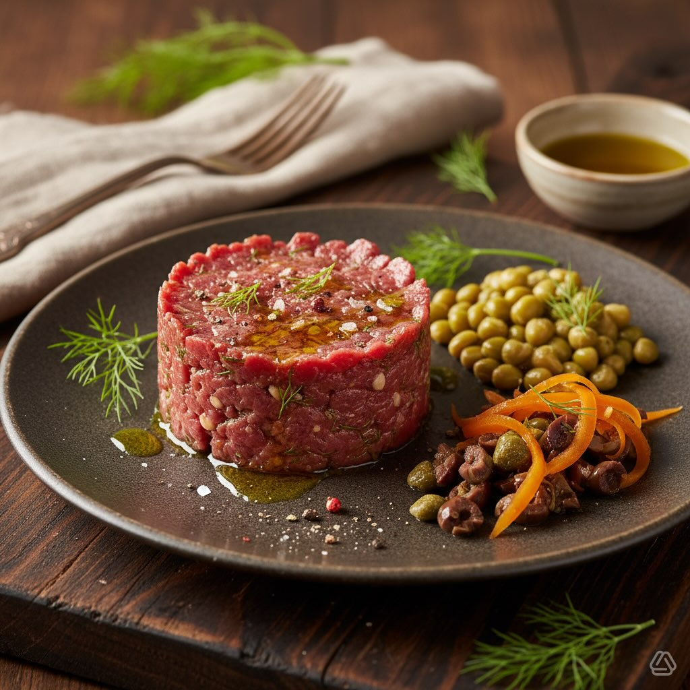

# #cucinaitaliana #foodlover #ricettadelgiorno ✨ Cosa ne pensi di aggiungere una s

#cucinaitaliana #foodlover #ricettadelgiorno ✨ Cosa ne pensi di aggiungere una spruzzata di aceto balsamico per un tocco extra? Ingredienti - Tartare di Chianina: 300 g (fesa o altro taglio magro, macinato o tritato al coltello) - Capperi sotto sale: 20 g (sciacquati e tritati) - Olive verdi denocciolate: 30 g, tritate grossolanamente - Finocchietto: 10 g, tritato finemente - Carote: 100 g, tagliate a julienne sottile - Roveja cotta: 150 g (già lessata) - Olio extravergine d’oliva: 20 g (circa 1½ cucchiaio) - Succo di limone: 1 cucchiaino - Sale e pepe nero q.b. - Facoltativo: un filo di aceto balsamico o scorza di limone per profumare Preparazione 1. Sicurezza: usa carne freschissima, mantienila ben fredda fino al momento del servizio e consumala subito. 2. Prepara la tartare: in una ciotola unisci la carne tritata con i capperi sciacquati e tritati, le olive, il finocchietto, 1 cucchiaino di succo di limone, sale e pepe. Mescola delicatamente per non riscaldare la carne. 3. Condisci la roveja: se è fredda, scaldala leggermente e condiscila con metà dell’olio, un pizzico di sale e pepe. Puoi aggiungere un po’ di finocchietto per continuità aromatica. 4. Carote: condisci la julienne di carote con un filo d’olio, poco succo di limone e pepe; lascia riposare 5–10 minuti. 5. Impiattamento: posiziona al centro un anello da cucina; riempi una metà con la tartare pressando leggermente; accanto o alla base disponi la roveja calda e le carote in julienne. Completa con un filo d’olio a crudo e, se vuoi, qualche cappero o oliva in superficie per decorare. 6. Servire: servi immediatamente, ben freddo. KPGC (totale piatto — 2 porzioni) - Calorie totali: ~1.094 kcal (≈547 kcal/porzione) - Proteine: ~92 g totali (≈46 g/porzione) - Grassi: ~62 g totali (≈31 g/porzione) - Carboidrati: ~43 g totali (≈21,5 g/porzione) Varianti / suggerimenti rapidi - Per ridurre i grassi: riduci l’olio a 10 g e usa 250 g di carne; le calorie diminuiscono. - Per più freschezza: aggiungi erba cipollina o prezzemolo. - Se non vuoi consumare carne cruda: sigilla leggermente la superficie con un cannello o cuoci la carne 30–60 s per lato in padella molto calda. #leguminando

---

*Ricetta da @leguminando*
