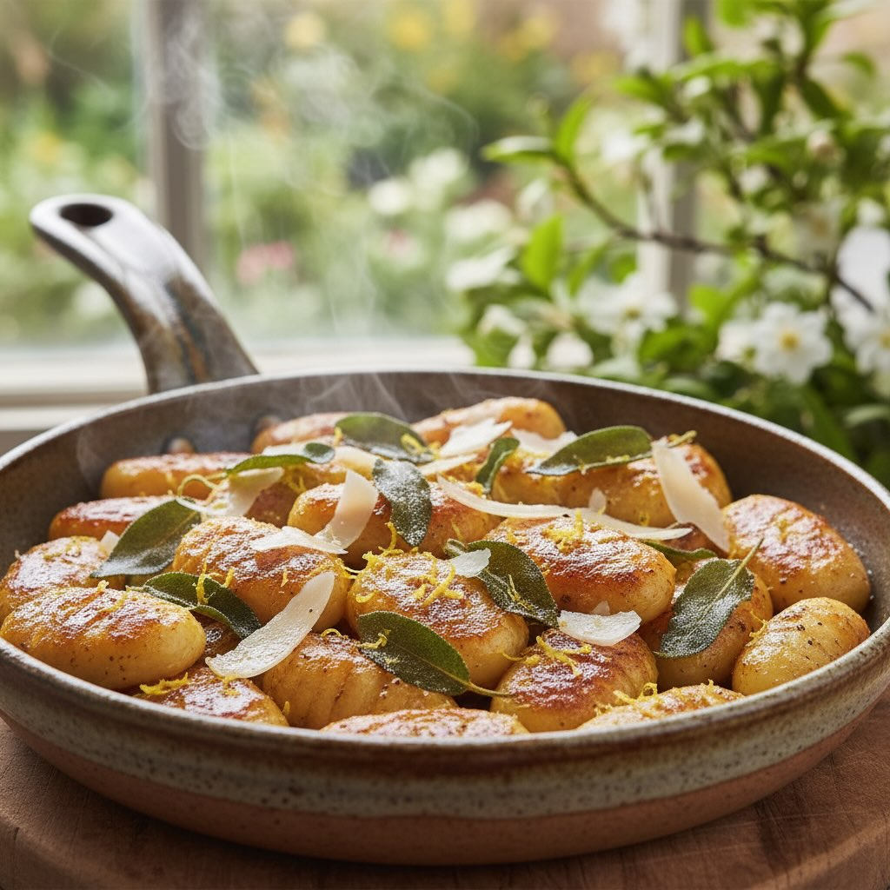

# #leguminando Gnocchi di Avena e Lenticchie alla Mediterranea **Ingredienti per 2

#leguminando Gnocchi di Avena e Lenticchie alla Mediterranea **Ingredienti per 2 persone** - 250 g di farina di avena - 100 g di farina di lenticchie rosse - 1 uovo grande - 50 ml di acqua tiepida (più se necessario) - Sale fino a poco più di ½ cucchiaino, a piacere - 6–8 pomodorini confit - 2 carciofi già puliti, tagliati a rondelle - Rucola fresca (una manciata) - Pistacchi sgusciati, tritati grossolanamente (1 cucchiaio) - Pecorino stagionato, grattugiato (q.b.) - Olio extravergine d’oliva (per soffriggere) Gnocchi di avena e lenticchie, un profumo di primavera. PROFILO NUTRIZIONALE Ricca di proteine (23 g) e fibre (10 g), questa preparazione sostiene sazietà, salute cardiovascolare e apporta calcio e potassio. #leguminando #cucinahealthy #ricettevegetariane #instagood

---

*Ricetta da @leguminando*
