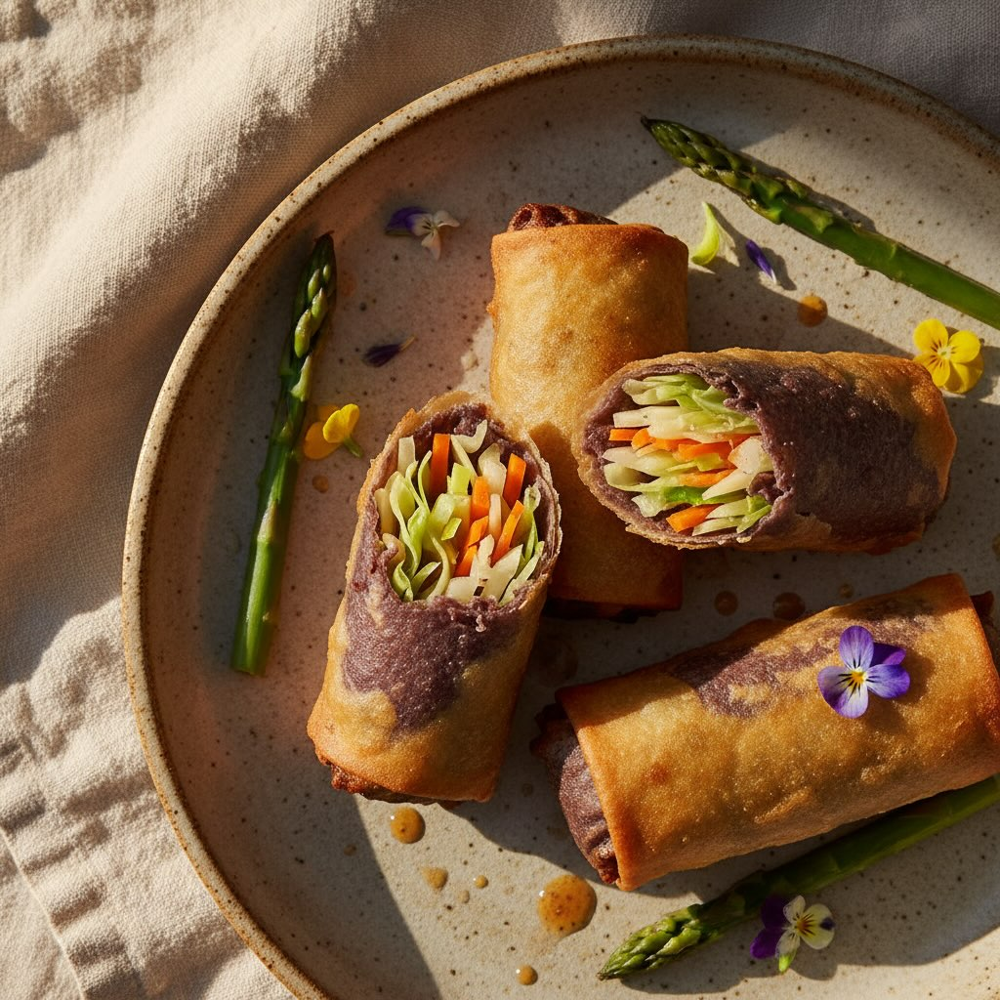

# #leguminando INVOLTINI DI LENTICCHIE ALLA PRIMAVERA Involtini di lenticchie, pri

#leguminando INVOLTINI DI LENTICCHIE ALLA PRIMAVERA Involtini di lenticchie, primavera in ogni morso 🌿 Profilo nutrizionale Proteine ~18g, fibre ~12g, ferro e potassio dalle lenticchie. Leggero, energetico, perfetto per l’outdoor. **Ingredienti (per 4 involtini da picnic)** **Per la pasta:** - 150 g di farina di lenticchie marroni - 100 g di farina di avena - 20 g di semi di lino macinati (o 2 cucchiai di psyllium) - Acqua tiepida q.b. (circa 150-180 ml) - Un pizzico di sale **Per il ripieno:** - 200 g di verza (solo foglie tenere) - 2 carote medie (circa 150 g) - 1 cipolla rossa - 1 gambo di sedano - 2 spicchi d’aglio - 2 porri medi - 6-8 asparagi freschi - Olio extravergine d’oliva - Sale e pepe q.b. **Per servire:** - Hummus di ceci (in un contenitore a parte) **Preparazione:** 1. **Pasta:** Mescola le farine e i semi di lino, aggiungendo gradualmente acqua tiepida per ottenere un impasto morbido ed elastico. Lascialo riposare per 30 minuti. 2. **Soffritto:** Soffriggi cipolla, sedano e carote. Aggiungi la verza e cuoci fino a che diventa tenera, poi condisci con sale e pepe. 3. **Porri:** Integra i porri al soffritto negli ultimi minuti di cottura. 4. **Asparagi:** Salta gli asparagi a julienne per 2 minuti, mantenendoli croccanti. 5. **Assemblaggio:** Stendi la pasta in uno strato sottile, taglia in rettangoli, aggiungi il ripieno e arrotola. 6. **Cottura/Consumo:** Puoi servire gli involtini a crudo o rosolarli in padella per ottenere una crosticina dorata.

---

*Ricetta da @leguminando*
