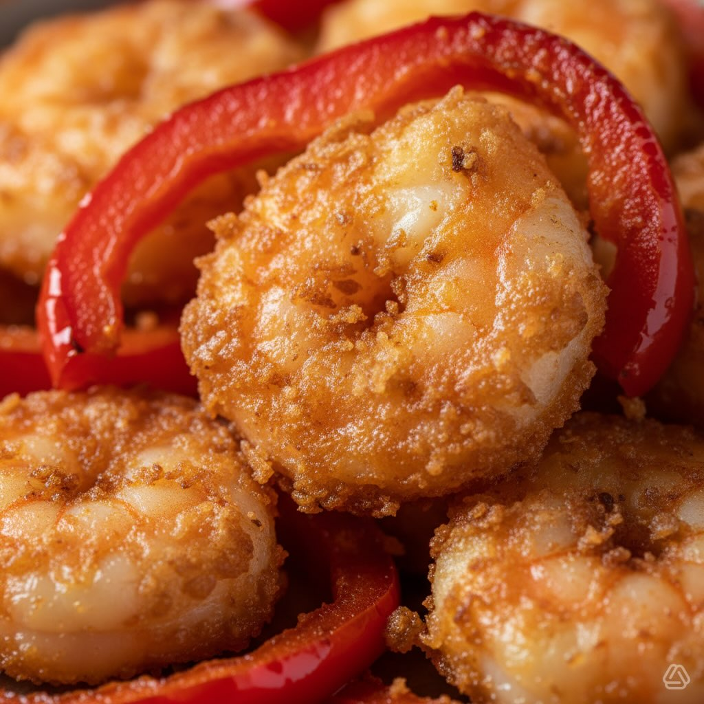

# #leguminando Ingredienti - Gamberi freschi, sgusciati: 200 g - Ceci precotti (pe

#leguminando Ingredienti - Gamberi freschi, sgusciati: 200 g - Ceci precotti (peso cotto): 150 g - Tahina: 20 g - Succo di limone: 15 g - Aglio: 3 g - Olio extravergine d’oliva (per hummus): 25 g - Peperone rosso: 150 g - Farina 00: 50 g - Acqua frizzante ghiacciata: 60 g - Aceto balsamico di Modena: 15 g - Succo di lime: 15 g - Olio extravergine d’oliva (per tartare): 15 g - Sale: 3 g - Pepe nero: 1 g - Olio di semi di arachidi (per friggere): 300 g (quantità in padella; vedi nota assorbimento) Tempi - Preparazione: 30 min - Cottura: 10 min (friggere + eventuale scaldata ceci) - Tempo totale: 40 min Difficoltà - Media Procedimento 1. Hummus: frulla ceci, tahina, succo di limone e aglio; aggiungi 25 g EVOO a filo fino a ottenere crema liscia; conserva in frigo. 2. Tartare: mantieni i gamberi freddi; tritali grossolanamente al coltello; condisci con succo di lime, 15 g EVOO, sale e pepe; conserva al fresco. 3. Tempura: taglia il peperone a strisce; mescola farina e acqua frizzante ghiacciata rapidamente (piccoli grumi); scalda olio a 170 °C; immergi e friggi fino a doratura; scola su carta assorbente. 4. Composizione: stendi hummus sul piatto con coppapasta, adagia la tartare, completa con tempura calda; finisci con gocce di balsamico.

---

*Ricetta da @leguminando*
