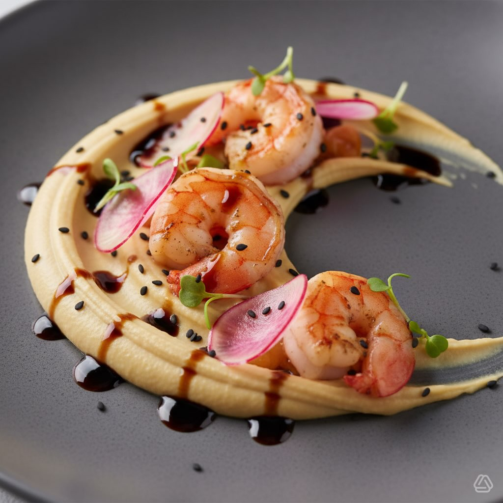

# #leguminando Ingredienti Per l’hummus - 250 g di ceci precotti, ben scolati - 1 

#leguminando Ingredienti Per l’hummus - 250 g di ceci precotti, ben scolati - 1 cucchiaio di tahina (crema di sesamo) - Il succo di mezzo limone - 1 spicchio d’aglio, privato del germe interno - 2 cucchiai di olio extravergine d’oliva - Un pizzico di cumino in polvere - Sale e pepe q.b. Per il condimento e la finitura - 10–12 gamberetti grandi, sgusciati e puliti - 4–5 ravanelli grandi, affettati molto sottili (quasi trasparenti) - Aceto balsamico di Modena ridotto (glassa) o una riduzione densa - Olio extravergine d’oliva per la rifinitura - Un pizzico di paprika dolce o affumicata - Fiori eduli o micro-ortaggi (opzionale, per decorare) - Semi di sesamo nero (opzionale, per contrasto cromatico) Preparazione 1. Preparazione dell’hummus: nel mixer unisci i ceci, la tahina, il succo di limone, l’aglio, il cumino, il sale e l’olio. Frulla fino a ottenere una crema liscia e vellutata; se troppo densa, aggiungi un cucchiaio di acqua fredda. Trasferisci in una ciotola e tieni a temperatura ambiente. 2. Cottura dei gamberetti: asciuga bene i gamberetti con carta da cucina. Scalda un filo d’olio in una padella antiaderente a fuoco vivo. Condisci i gamberetti con un pizzico di sale e paprika. Scottali 1–2 minuti per lato, fino a quando diventano opachi e leggermente dorati: devono restare succosi all’interno. Togli dal fuoco e tieni da parte. 3. Preparazione dei ravanelli: immergi le fettine di ravanello in una ciotola con acqua e ghiaccio per 5 minuti per aumentarne la croccantezza. Scolale e asciugale delicatamente. 4. Impiattamento: - Usa un piatto piano, preferibilmente scuro o in pietra per far risaltare i colori. - Base: spalma l’hummus sul fondo con il dorso di un cucchiaio creando un movimento circolare e un piccolo incavo al centro. - Protagonisti: adagia i gamberi caldi sopra l’hummus. - Croccantezza: disponi le fettine di ravanello in modo armonioso sopra i gamberi e l’hummus. - Tocco finale: decora con piccoli punti o fili di riduzione di aceto balsamico, un filo d’olio a crudo, una spolverata di semi di sesamo nero e qualche micro-ortaggio o fiore edule.

---

*Ricetta da @leguminando*
