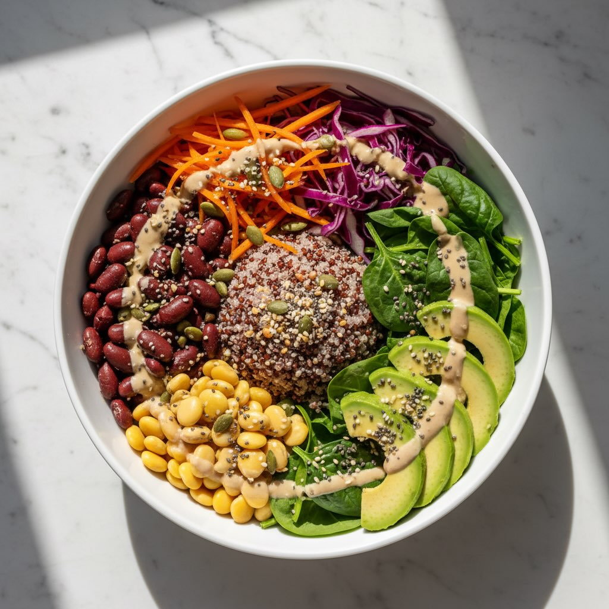

# #leguminando Ingredienti (per 1 porzione post-allenamento)** **Base proteica:** 

#leguminando Ingredienti (per 1 porzione post-allenamento)** **Base proteica:** - 80 g di roveja precotta, scolata - 60 g di lupini precotti, scolati e spellati - 60 g di quinoa rossa o farro perlato **Verdure (crude o leggermente cotte):** - 100 g di spinacini freschi - 1 carota media, tagliata a julienne o spiralizzata - ½ avocado maturo - 50 g di cavolo rosso, tagliato a julienne sottile **Salsa Tahina:** - 2 cucchiai di tahina (pasta di sesamo) - Succo di ½ limone - 1 cucchiaio di acqua tiepida - Sale e pepe q.b. **Topping extra:** - 1 cucchiaio di semi di canapa decorticati - Pepe nero macinato al momento - Scorza di limone grattugiata La ciotola che ricarica dopo l’allenamento senza pesare sullo stomaco. Lupini (40% proteine) e roveja (il diamante nero dei legumi) si uniscono alla quinoa per un piatto bilanciato 40-30-30 che nutre i muscoli e sazia a lungo. La tahina completa il profilo proteico, mentre le verdure primaverili donano vitamine, ferro e antiossidanti.

---

*Ricetta da @leguminando*
