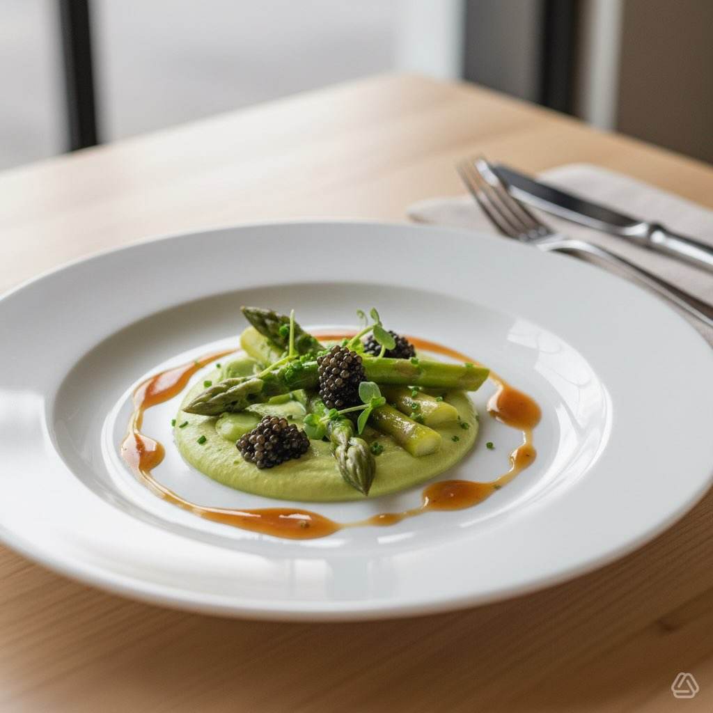

# #leguminando Scopri un antipasto raffinato che unisce consistenze e sapori: punt

#leguminando Scopri un antipasto raffinato che unisce consistenze e sapori: punte d’asparagi croccanti, vellutata crema di fave e lussureggiante caviale di lumache, esaltati da una riduzione lucida di champagne. Ingredienti - 400 g asparagi verdi (solo punte + 1/3 del gambo tagliato a rondelle sottili) - 150–200 g crema di fave (già pronta o frullata con olio, sale e poco limone) - 40–60 g caviale di lumache (a temperatura ambiente) - 150 ml champagne (o spumante secco) - 30 g burro freddo a cubetti - 1 cucchiaino scalogno tritato finissimo (opzionale) - 1 cucchiaio olio d’oliva extravergine - Sale e pepe nero macinato fresco - Qualche goccia di limone (opzionale) - Erbe fresche per guarnire: erba cipollina o micro-greens Preparazione 1. Preparare gli asparagi: - Portare a bollore una pentola d’acqua salata. Sbollentare le punte e le rondelle per 1–2 minuti finché sono tenere ma ancora croccanti. Scolare e raffreddare rapidamente in acqua ghiacciata. Asciugare e tenere da parte. 2. Riduzione di champagne: - In un pentolino, mettere lo scalogno tritato (se usato) e lo champagne. Portare a ebollizione leggera e far ridurre fino a circa 3–4 cucchiai bassi di liquido (consistenza sciropposa), circa 6–8 minuti. - Togliere dal fuoco e incorporare il burro freddo a cubetti mescolando energicamente per emulsionare e ottenere una salsa lucida. Aggiustare di sale e pepe. Tenere tiepida. 3. Assemblaggio: - Su ogni piatto mettere 2–3 cucchiai di crema di fave come base (stendere leggermente). - Disporre sopra le punte e le rondelle di asparagi in modo armonico. - Con un cucchiaino, adagiare 10–15 g di caviale di lumache su ogni porzione (non mescolare: tenere il caviale in superficie). - Versare qualche goccia di riduzione di champagne intorno alla crema (non direttamente sul caviale per non coprirne il sapore). - Condire con un filo di olio d’oliva, una macinata di pepe e qualche goccia di limone a piacere. Guarnire con erba cipollina o micro-greens.

---

*Ricetta da @leguminando*
