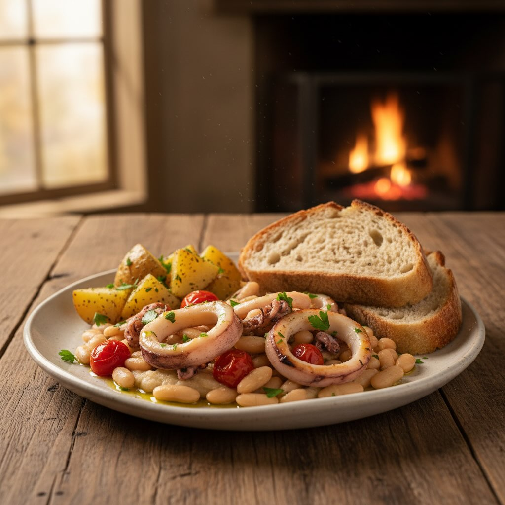

# #leguminando Seppie e Fagioli!! Sperando nella bella stagione!! 💪🏻💪🏻🤞🤞 - 800 g d

#leguminando Seppie e Fagioli!! Sperando nella bella stagione!! 💪🏻💪🏻🤞🤞 - 800 g di seppie fresche - 400 g di fagioli cannellini cotti - 2 spicchi d’aglio - 1 cipolla - 1 carota - 1 costa di sedano - 200 g di pomodorini - 1 bicchiere di vino bianco secco - Olio extravergine d’oliva - Prezzemolo fresco tritato - Sale e pepe q.b. - 400 g di patate lesse, a tocchetti - Pane casereccio, a fette ### Preparazione 1. **Pulizia delle Seppie**: - Pulisci le seppie rimuovendo l’osso, gli occhi e la pelle. Tagliale a strisce. 2. **Preparazione delle Verdure**: - Trita finemente la cipolla, l’aglio, la carota e il sedano. - Taglia i pomodorini a metà. 3. **Soffritto**: - In una padella capiente, scalda un po’ d’olio extravergine d’oliva e aggiungi il trito di cipolla, aglio, carota e sedano. Fai soffriggere finché le verdure non diventano morbide. 4. **Cottura delle Seppie**: - Aggiungi le seppie al soffritto e cuoci a fuoco medio per circa 5 minuti. - Sfuma con il vino bianco e lascia evaporare. 5. **Aggiunta dei Fagioli e Pomodorini**: - Aggiungi i fagioli cannellini e i pomodorini. Mescola bene e lascia cuocere per altri 15 minuti. - Condisci con sale, pepe e prezzemolo fresco tritato.

---

*Ricetta da @leguminando*
