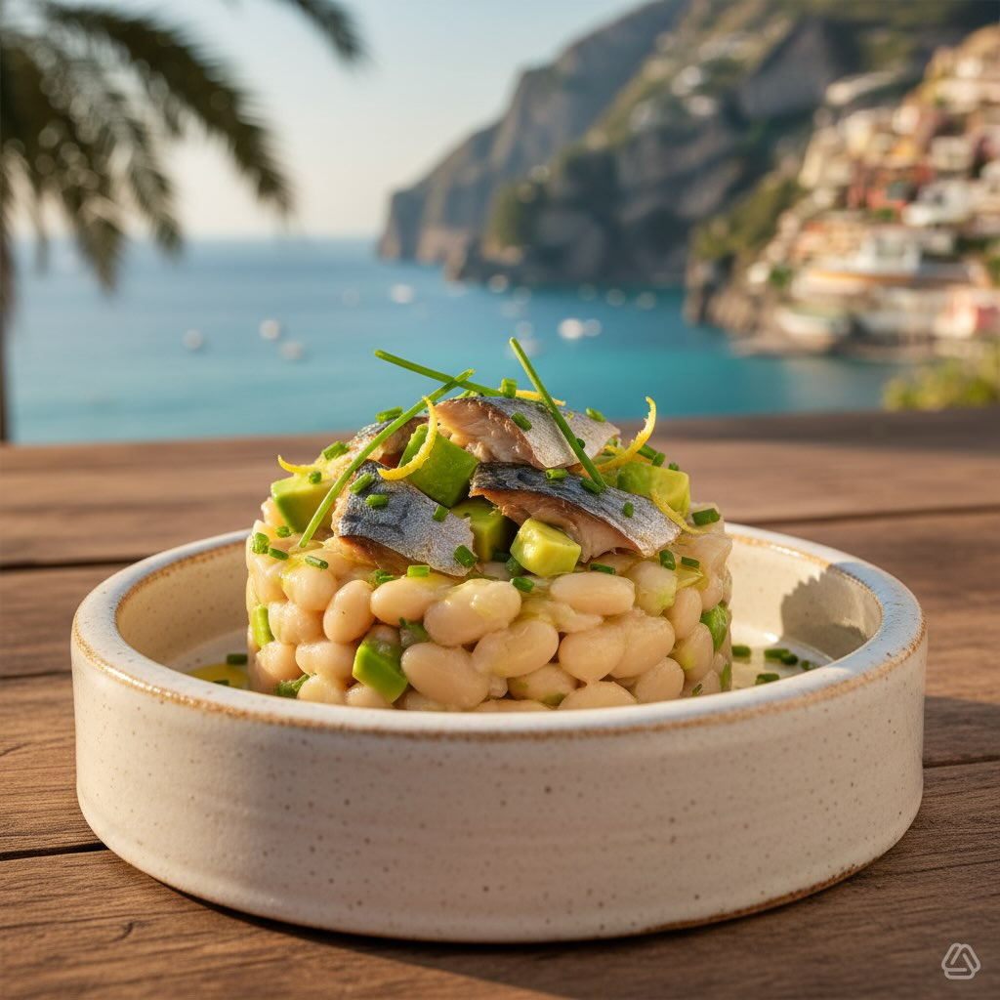

# #leguminando ### Base Tartare di Fagioli - 400 g di fagioli cannellini precotti,

#leguminando ### Base Tartare di Fagioli - 400 g di fagioli cannellini precotti, scolati - 2 cipollotti freschi, circa 30 g in totale - 3 cucchiai di olio extravergine di oliva (EVO) - 2 cucchiai di succo di limone - 1 cucchiaino di sale marino - 1/2 cucchiaino di pepe nero macinato # Guarnizione - 150 g di sgombro affumicato a fette - 1 avocado maturo, circa 200 g di polpa - Erba cipollina fresca, quanto basta - Scorza di limone grattugiata, quanto basta - Filo di olio EVO a crudo Preparazione **Base di Fagioli:** - Scolare e risciacquare i fagioli, poi schiacciarli grossolanamente. - Affettare il cipollotto e unirlo ai fagioli. - Condire con olio EVO, limone, sale e pepe, mescolare e lasciare insaporire. **Guarnizione:** - Tagliare lo sgombro a listarelle. - Tagliare l&#039;av’cado a cubetti e cospargere con limone per evitare l&#039;os’idazione. **Assemblaggio:** *Versione Elegante:* - Usare un anello da dessert per stratificare fagioli, avocado e sgombro. Rimuovere l’anello. *Versione Rustica:* - Disporre i fagioli in una ciotola e guarnire con avocado e sgombro decorativamente.

---

*Ricetta da @leguminando*
