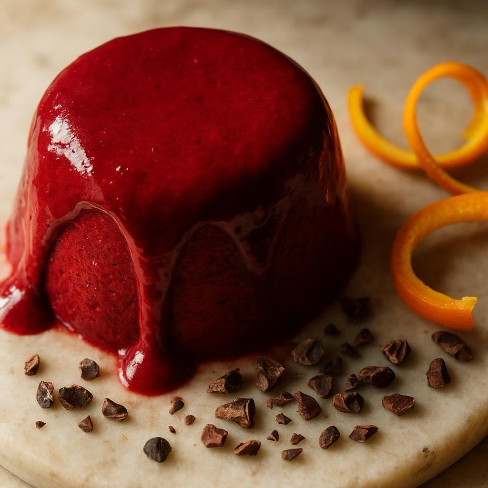

# #leguminando ## Ingredienti # Mousse - 150 ml di latte di avena (o panna di cocc

#leguminando ## Ingredienti # Mousse - 150 ml di latte di avena (o panna di cocco) - 80 g di farina di carrube - 100 g di barbabietola cotta e pelata - 100 g di cioccolato fondente al 70% - 2 g di agar-agar in polvere - 30 g di zucchero di canna integrale - Scorza grattugiata di 1 arancia biologica Base Croccante - 60 g di fiocchi d’avena integrali - 20 g di burro (o olio di cocco) - 10 g di zucchero di canna - 30 g di cacao in chicchi tostati e spezzettati Decorazione - Chicchi di cacao interi tostati - Scorza d’arancia candita a julienne - Sale Maldon in scaglie — Preparazione 1. **Tostare il Cacao**: In una padella, tosta i chicchi di cacao per 3 minuti. Spezza grossolanamente alcuni chicchi. 2. **Preparare la Base Croccante**: Tosta i fiocchi d’avena con burro e zucchero per 5 minuti. Aggiungi i chicchi di cacao spezzettati, poi stendi il composto su carta forno. Lascia raffreddare e sbriciola sul fondo dei bicchieri. 3. **Preparare la Barbabietola**: Frulla la barbabietola con un po’ di latte fino a ottenere una crema liscia. Passa al setaccio se necessario. 4. **Preparare la Carrube**: Porta a ebollizione 100 ml di acqua con la farina di carrube, lo zucchero e l’agar-agar’per 2 minuti. 5. **Sciogliere il Cioccolato**: Sciogli a bagnomaria e unisci alla crema di carrube. 6. **Montare la Mousse**: Unisci la purea di barbabietola, il latte freddo e la scorza d’arancia. ’escola delicatamente con le fruste (non montare troppo). 7. **Raffreddare**: Versa la mousse nei bicchieri, copri con pellicola a contatto e lascia in frigorifero per 4 ore. 8. **Decorare**: Decora con chicchi di cacao interi, scorza d’arancia candita e sale Maldon.

---

*Ricetta da @leguminando*
