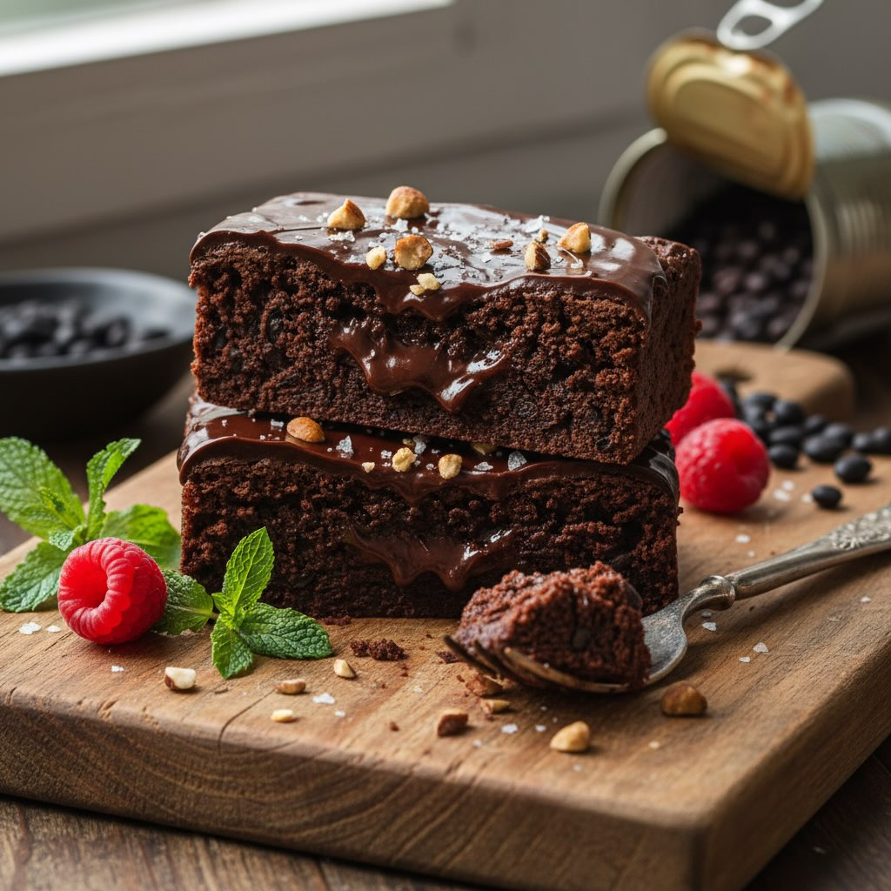

# #leguminando ### Procedimento per i Brownies 1

#leguminando ### Procedimento per i Brownies 1. **Preparazione Fagioli**: - Se usi fagioli secchi, assicurati di lessarli fino a quando sono morbidi, poi scolali e sciacquali bene. Se usi fagioli precotti, basta sciacquarli e scolarli. 2. **Sciogli il Cioccolato**: - In una ciotola resistente al calore, sciogli i 100g di cioccolato fondente con i 3 cucchiai di olio di cocco a bagnomaria o nel microonde. Mescola fino a ottenere un composto liscio. 3. **Frullare gli Ingredienti**: - In un frullatore o robot da cucina, unisci i fagioli neri, il cioccolato fuso, le uova, lo zucchero di canna, il cacao in polvere, l’estratto di vaniglia, il lievito e il pizzico di sale. Frulla fino a ottenere un composto omogeneo. 4. **Cuocere**: - Versa il composto in una teglia rettangolare rivestita con carta da forno. Livella la superficie con una spatola. - Cuoci in forno preriscaldato a 180°C per circa 25-30 minuti. I brownies devono risultare compatti ma ancora leggermente umidi al centro. # Preparazione della Glassa 1. **Sciogliere il Cioccolato**: - Sciogli i 50g di cioccolato fondente con 1 cucchiaio di olio di cocco seguendo lo stesso procedimento di prima. 2. **Applicare la Glassa**: - Una volta che i brownies si sono raffreddati, spalmaci sopra la glassa. Cospargi con granella di nocciole o mandorle tostate per un tocco croccante. Guarnizioni (Opzionali) - **Frutta Fresca**: Decora con lamponi o more. - **Aromi Aggiuntivi**: Aggiungi una leggera grattugiata di scorza d&#039;aran’ia e qualche fiocco di sale per esaltare i sapori. - **Noci**: Spolvera con noci pecan o noci a pezzetti per un extra crunch.

---

*Ricetta da @leguminando*
